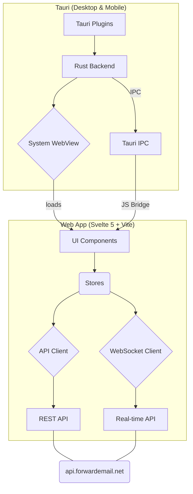
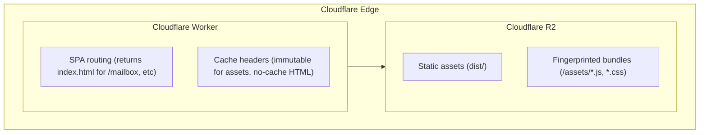

# Forward Email - Webmail, Desktop, and Mobile

This is the official, open-source, and end-to-end encrypted webmail client for [Forward Email](https://forwardemail.net). It is available as a fast and modern web app, a cross-platform desktop app for Windows, macOS, and Linux, and a native mobile app for iOS and Android.

## Downloads & Releases

When the release pipelines are enabled, all official builds will be produced automatically via secure, tamper-proof [GitHub Actions workflows](https://github.com/forwardemail/mail.forwardemail.net/actions), ensuring a transparent and auditable trail from source code to the final compiled binary. Binaries for all platforms will be cryptographically signed and, where applicable, notarized to ensure their authenticity and integrity. Releases will be published on the [GitHub Releases](https://github.com/forwardemail/mail.forwardemail.net/releases) page.

| Platform    | Architecture          | Download                                             | Store                     |
| :---------- | :-------------------- | :--------------------------------------------------- | :------------------------ |
| **Web**     | —                     | [app.forwardemail.net](https://app.forwardemail.net) | —                         |
| **Windows** | x64                   | `.msi` (Coming Soon)                                 |                           |
| **macOS**   | Apple Silicon & Intel | `.dmg` (Coming Soon)                                 | App Store (Coming Soon)   |
| **Linux**   | x64                   | `.deb` / `.AppImage` (Coming Soon)                   |                           |
| **Android** | Universal             | `.apk` (Coming Soon)                                 | Google Play (Coming Soon) |
|             |                       |                                                      | F-Droid (Coming Soon)     |
| **iOS**     | arm64                 | Coming Soon                                          | App Store (Coming Soon)   |

> **Note for macOS users:** If you download the `.dmg` from GitHub Releases, you may need to run the following command if you see a "damaged" or unverified app error:
>
> ```bash
> sudo xattr -rd com.apple.quarantine /Applications/ForwardEmail.app
> ```
>
> Replace `/Applications/ForwardEmail.app` with the actual path if you installed the app elsewhere.

## Security & Privacy

Security is the foundational principle of this application. We are committed to transparency and providing users with control over their data. For a detailed overview of our security practices, please see:

- [Security Policy](https://forwardemail.net/security)
- [security.txt](https://forwardemail.net/.well-known/security.txt)

### Client-Side Encryption & App Lock

The application offers a robust **App Lock** feature that enables cryptographic encryption for your entire client-side database and settings — in the browser, on desktop, or on mobile. When enabled from the **Settings > Privacy & Security** menu, all sensitive data stored locally (including message bodies, contacts, and API tokens) is encrypted at rest using the `XSalsa20-Poly1305` stream cipher from the audited `libsodium` library.

This feature can be secured using two methods:

1.  **Passkey (WebAuthn)**: For the highest level of security, you can lock and unlock the application using a FIDO2/WebAuthn-compliant authenticator. This allows you to use hardware security keys or your device's built-in biometrics. The encryption key is derived directly from the authenticator using the PRF extension, meaning the key is never stored on the device itself.
2.  **PIN Code**: For convenience, you can set a simple PIN code. This provides an iOS-like lock screen experience, ideal for quick access on mobile devices.

Our implementation supports a wide range of authenticators for Passkey-based App Lock:

| Type                        | Examples                                                                                                        |
| :-------------------------- | :-------------------------------------------------------------------------------------------------------------- |
| **Platform Authenticators** | Apple Touch ID, Face ID, Optic ID, Windows Hello, Android Biometrics (fingerprint, face)                        |
| **Hardware Security Keys**  | YubiKey 5 Series, YubiKey Bio, Google Titan, Feitian ePass/BioPass, SoloKeys, Nitrokey 3, HID Crescendo, Ledger |
| **Cloud/Software Passkeys** | iCloud Keychain, Google Password Manager, Samsung Pass, 1Password, Dashlane, Bitwarden, Proton Pass             |

### Tamper-Proof Builds

All builds are handled by public GitHub Actions workflows directly from the source code. Desktop applications are signed with platform-specific certificates (Apple Developer ID and Windows EV Code Signing) and the Tauri updater uses Ed25519 signatures to verify the integrity of every update package. All auto-updates, notifications, and IDLE-like real-time push support are handled directly between the app and our servers with zero third-party involvement.

## Features

- **Blazing Fast**: Built with Rust and Svelte 5 for a lightweight and responsive experience.
- **End-to-End Encrypted**: Cryptographic encryption for your entire client-side app — browser, desktop, or mobile.
- **Open-Source**: All code for the web, desktop, and mobile apps is available on GitHub.
- **Zero Third-Party Involvement**: Auto-updates, notifications, and real-time IDLE-like push support are handled directly by the app with no third-party servers or services involved.
- **Real-time Updates**: Mailbox updates are pushed instantly via WebSockets.
- **Cross-Platform Notifications**: Native desktop and mobile push notifications.
- **Multi-account** — Login with multiple Forward Email accounts, alias auth, and optional API key override.
- **Mailbox** — Folders, message threading, bulk actions, keyboard shortcuts, attachment handling, PGP decryption.
- **Compose** — Rich text editor (TipTap), CC/BCC, emoji picker, attachments, draft autosave, offline outbox queue.
- **Search** — Full-text search with FlexSearch, optional body indexing, saved searches, background indexing.
- **Offline Support**: A custom main-thread sync engine provides offline access and queues outgoing actions, replacing the need for a Service Worker and ensuring functionality on all platforms including Ionic/Capacitor mobile.
- **Calendar** — Month/week/day views, quick add/edit/delete, iCal export.
- **Contacts** — CRUD operations, vCard import/export, deep links to compose/search.
- **Demo Mode**: Evaluate the app's features offline without an account.
- **`mailto:` Handler**: Registers as the default email client on desktop platforms.
- **Auto-Updates**: Desktop apps automatically check for and install new versions securely.

## Architecture Overview

The application is built on a unified architecture that reuses the same Svelte 5 web application as the UI for all platforms. Tauri v2 provides the cross-platform shell, using a Rust backend for native capabilities and system webviews for rendering the UI.



For more detail, please see the full [Architecture Document](./docs/ARCHITECTURE.md).

## Tech Stack

| Category             | Technologies                                                         |
| -------------------- | -------------------------------------------------------------------- |
| **Web**              | Svelte 5, Vite, pnpm                                                 |
| **Desktop & Mobile** | Tauri v2 (Rust backend, Svelte frontend)                             |
| **Styling**          | Tailwind CSS 4, PostCSS                                              |
| **State**            | Svelte Stores                                                        |
| **Database**         | Dexie 4 (IndexedDB)                                                  |
| **Search**           | FlexSearch                                                           |
| **Editor**           | TipTap 2                                                             |
| **Calendar**         | schedule-x                                                           |
| **Real-time**        | WebSocket with msgpackr binary encoding                              |
| **Encryption**       | libsodium-wrappers (XSalsa20-Poly1305, Argon2id), OpenPGP            |
| **Passkeys**         | @passwordless-id/webauthn (FIDO2/WebAuthn with PRF extension)        |
| **Testing**          | Vitest, Playwright for E2E tests, WebdriverIO for Tauri binary tests |
| **Tooling**          | ESLint 9, Prettier 3, Husky, commitlint                              |

### Key Components

- **Main Thread** — Svelte components, stores, routing, UI rendering
- **db.worker** — Owns IndexedDB via Dexie, handles all database operations
- **sync.worker** — API fetching, message parsing (PostalMime), data normalization
- **search.worker** — FlexSearch indexing and query execution

### Documentation

Detailed architecture documentation is available in the `docs/` directory:

- [Architecture](./docs/ARCHITECTURE.md) — Full architecture document
- [Vision & Architecture](docs/building-webmail-vision-architecture.md) — Design principles and architectural patterns
- [Worker Architecture](docs/worker-architecture.md) — Worker responsibilities and message passing
- [Cache & Indexing](docs/cache-indexing-architecture.md) — Storage layers and data flow
- [Search](docs/building-webmail-search.md) — FlexSearch setup and query parsing
- [Service Worker](docs/building-webmail-service-worker.md) — Asset caching strategy
- [DB Schema & Recovery](docs/building-webmail-db-schema-recovery.md) — Database management
- [Desktop Build CI](docs/desktop-build-ci.md) — How the desktop build is triggered and tested
- [Desktop CI Secrets](docs/desktop-ci-secrets.md) — CI secrets setup for desktop signing
- [Desktop Contributing](docs/desktop-contributing.md) — Desktop architecture and IPC patterns
- [Desktop Setup](docs/desktop-setup.md) — Developer environment setup for desktop
- [Desktop & Mobile Development](./docs/DEVELOPMENT.md) — Platform-specific development guide
- [Release Process](./docs/RELEASES.md) — How releases are managed
- [Security Hardening](./docs/SECURITY.md) — Security practices and hardening
- [App Lock Architecture](docs/app-lock-architecture.md) — Client-side encryption and App Lock design
- [Push Notifications](./docs/PUSH_NOTIFICATIONS.md) — Push notification setup
- [WebSocket](./docs/WEBSOCKET.md) — Real-time WebSocket protocol
- [Tauri Testing](./docs/TAURI_TESTING.md) — Testing Tauri desktop/mobile apps
- [Secrets](./docs/SECRETS.md) — Secrets management for CI/CD
- [Workers](docs/building-webmail-workers.md) — Worker mesh architecture
- [Technology Stack](docs/building-webmail-technology-stack.md) — Technology choices and rationale
- [Mailbox Loading Flow](docs/mailbox-loading-flow.md) — Full request lifecycle for loading messages
- [Clear-Site-Data](docs/clear-site-data-spec.md) — Client reset kill switch specification
- [Deployment Checklist](docs/deployment-checklist.md) — Step-by-step deployment guide
- [Building Webmail Series](docs/building-webmail-series.md) — Technical deep-dive blog series overview
- [Vision Gap Analysis](docs/webmail-vision-gap-analysis.md) — Gap analysis between vision spec and implementation

## Project Structure

```
src/
├── main.ts                 # App bootstrap, routing, service worker registration
├── config.ts               # Environment configuration
├── stores/                 # Svelte stores (state management)
│   ├── mailboxStore.ts     # Message list, folders, threading
│   ├── mailboxActions.ts   # Move, delete, flag, label actions
│   ├── messageStore.ts     # Selected message, body, attachments
│   ├── searchStore.ts      # Search queries and index health
│   ├── settingsStore.ts    # User preferences, theme, PGP keys
│   └── ...
├── svelte/                 # Svelte components
│   ├── Mailbox.svelte      # Main email interface
│   ├── Compose.svelte      # Email composer
│   ├── Calendar.svelte     # Calendar view
│   ├── Contacts.svelte     # Contact management
│   ├── Settings.svelte     # User settings
│   └── components/         # Reusable components
├── workers/                # Web Workers
│   ├── db.worker.ts        # IndexedDB operations
│   ├── sync.worker.ts      # API sync and parsing
│   └── search.worker.ts    # Search indexing
├── utils/                  # Utilities
│   ├── remote.js           # API client
│   ├── db.js               # Database initialization
│   ├── storage.js          # LocalStorage management
│   └── ...
├── lib/components/ui/      # UI component library (shadcn/ui)
├── styles/                 # CSS (Tailwind + custom)
├── locales/                # i18n translations
└── types/                  # TypeScript definitions
```

## Getting Started

### Prerequisites

- Node.js 20+
- pnpm 9.0.0+
- [Rust](https://rustup.rs/) and [Tauri v2 prerequisites](https://v2.tauri.app/start/prerequisites/) (for desktop/mobile development)

### Installation

```bash
pnpm install
```

### Development

```bash
pnpm dev              # Start web dev server (http://localhost:5174)
pnpm tauri dev        # Start desktop dev mode
pnpm tauri android dev  # Start Android dev mode
pnpm tauri ios dev      # Start iOS dev mode
```

### Build

```bash
pnpm build        # Build to dist/ + generate service worker
pnpm preview      # Preview production build locally
pnpm analyze      # Build with bundle analyzer
```

### Code Quality

```bash
pnpm lint         # Run ESLint
pnpm lint:fix     # Fix linting issues
pnpm format       # Check formatting
pnpm format:fix   # Fix formatting
pnpm check        # Run svelte-check
```

### Testing

```bash
# Unit tests (Vitest)
pnpm test              # Run all tests
pnpm test:watch        # Watch mode
pnpm test:coverage     # Generate coverage report

# E2E tests (Playwright)
pnpm exec playwright install --with-deps  # First-time setup
pnpm test:e2e          # Run e2e tests
```

## Contributing

### Commit Messages

This project uses [Conventional Commits](https://www.conventionalcommits.org/) enforced by commitlint. Every commit message must follow the format:

```
type(scope): description
```

| Type       | When to use                             | Version bump |
| ---------- | --------------------------------------- | ------------ |
| `feat`     | New feature                             | minor        |
| `fix`      | Bug fix                                 | patch        |
| `docs`     | Documentation only                      | none         |
| `refactor` | Code change that neither fixes nor adds | none         |
| `perf`     | Performance improvement                 | patch        |
| `test`     | Adding or updating tests                | none         |
| `chore`    | Build, CI, tooling changes              | none         |

Scope is optional: `fix(compose): handle pasted recipients` or `fix: handle pasted recipients` are both valid.

To trigger a **major** version bump, add a `BREAKING CHANGE:` footer:

```
feat: redesign settings page

BREAKING CHANGE: settings store schema changed, requires cache clear
```

### Releasing

Releases are managed locally using [np](https://github.com/sindresorhus/np). The web application is deployed automatically via GitHub Actions when a GitHub Release is published. Desktop and mobile release pipelines are currently being finalized (tag triggers are disabled; see workflow files for current status).

```bash
pnpm release            # interactive version prompt, runs checks, pushes, publishes GitHub Release
```

This command will:

1. Verify a clean working tree and up-to-date `main` branch
2. Run lint, format, tests, and build
3. Bump the version in `package.json` and create a git tag
4. Push the commit and tag to GitHub
5. Publish a GitHub Release

Once the release pipeline is enabled, pushing the tag will trigger the **Release** workflow (`.github/workflows/release.yml`), which creates a draft GitHub Release and orchestrates desktop and mobile builds. In the meantime, releases can be triggered manually via `workflow_dispatch` on the release workflows. Once a release is published, the **Deploy** workflow (`.github/workflows/deploy.yml`) automatically deploys the web application to Cloudflare.

## Configuration

Create a `.env` file to override defaults:

```bash
# API base URL (Vite requires VITE_ prefix for client exposure)
VITE_WEBMAIL_API_BASE=https://api.forwardemail.net
```

## Deployment

> **First time setup?** See the complete [Deployment Checklist](docs/deployment-checklist.md) for step-by-step instructions on Cloudflare, GitHub Actions, and DNS configuration.

### Infrastructure



### Cache Strategy

| Asset Type                                  | Cache-Control                 | Reason                                       |
| ------------------------------------------- | ----------------------------- | -------------------------------------------- |
| `index.html`, `/mailbox`, `/calendar`, etc. | `no-cache, no-store`          | Always fetch fresh HTML for updates          |
| `/assets/*` (JS, CSS)                       | `immutable, max-age=31536000` | Fingerprinted by Vite, safe to cache forever |
| `sw.js`, `sw-*.js`, `version.json`          | `no-cache, must-revalidate`   | Service worker must check for updates        |
| `/icons/*`                                  | `max-age=2592000`             | 30 days, rarely change                       |
| Fonts (`.woff2`)                            | `immutable, max-age=31536000` | Fingerprinted, cache forever                 |

### CI/CD Pipeline

CI and deployment are handled by separate GitHub Actions workflows for web, desktop, and mobile:

**Desktop Build** (`.github/workflows/build-desktop.yml`) — runs on pull requests to `main` (when `src-tauri/`, `src/`, `package.json`, or `pnpm-lock.yaml` change) and via `workflow_dispatch`. See [Desktop Build CI guide](docs/desktop-build-ci.md) for contributor details.

**Mobile Build** (`.github/workflows/build-mobile.yml`) — currently disabled for automatic triggers (push/PR triggers are commented out until mobile CI is ready). Can be triggered manually via `workflow_dispatch`.

**E2E Tests (Apps)** (`.github/workflows/e2e-apps.yml`) — currently disabled for automatic triggers (push/PR triggers are commented out until Tauri E2E tests are ready). Can be triggered manually via `workflow_dispatch`.

**Web CI** (`.github/workflows/ci.yml`) — runs on every push to `main` and on pull requests:

1. **Install** — `pnpm install --frozen-lockfile`
2. **Lint** — `pnpm lint`
3. **Format** — `pnpm format`
4. **Unit tests** — `pnpm test -- --run`
5. **Build** — `pnpm build` (Vite + Workbox service worker)
6. **E2E tests** — Playwright (pull requests only)
7. **Deploy** — On release commits (`chore(release):`) to `main`, deploys to Cloudflare R2 + Worker + cache purge

**Deploy** (`.github/workflows/deploy.yml`) — runs when a GitHub Release is published:

1. **Build** — Full production build
2. **Deploy to R2** — Sync `dist/` to Cloudflare R2 bucket
3. **Deploy Worker** — Deploy CDN worker for SPA routing + cache headers
4. **Purge Cache** — Clear Cloudflare edge cache

**Release** (`.github/workflows/release.yml`) — currently disabled for automatic tag triggers (will be enabled when desktop/mobile release pipelines are ready). Can be triggered manually via `workflow_dispatch`. Once enabled, it will orchestrate GitHub Release creation, desktop builds, mobile builds, and checksum generation.

### Required Secrets & Variables

**GitHub Secrets:**

| Secret                               | Description                                     |
| ------------------------------------ | ----------------------------------------------- |
| `R2_ACCOUNT_ID`                      | Cloudflare account ID (also used for Workers)   |
| `R2_ACCESS_KEY_ID`                   | R2 API access key                               |
| `R2_SECRET_ACCESS_KEY`               | R2 API secret key                               |
| `CLOUDFLARE_ZONE_ID`                 | Zone ID for cache purge                         |
| `CLOUDFLARE_API_TOKEN`               | API token with R2 + Workers + Cache permissions |
| `TAURI_SIGNING_PRIVATE_KEY`          | Tauri updater Ed25519 signing key               |
| `TAURI_SIGNING_PRIVATE_KEY_PASSWORD` | Password for the Tauri signing key              |
| `APPLE_CERTIFICATE`                  | macOS code signing certificate (base64)         |
| `APPLE_CERTIFICATE_PASSWORD`         | Password for the Apple certificate              |
| `APPLE_SIGNING_IDENTITY`             | Apple Developer ID signing identity             |
| `APPLE_ID`                           | Apple ID for notarization                       |
| `APPLE_PASSWORD`                     | App-specific password for notarization          |
| `APPLE_TEAM_ID`                      | Apple Developer Team ID                         |
| `WINDOWS_CERTIFICATE`                | Windows EV code signing certificate (base64)    |
| `WINDOWS_CERTIFICATE_PASSWORD`       | Password for the Windows certificate            |
| `ANDROID_KEYSTORE_BASE64`            | Android signing keystore (base64)               |
| `ANDROID_KEYSTORE_PASSWORD`          | Password for the Android keystore               |
| `ANDROID_KEY_ALIAS`                  | Android signing key alias                       |
| `ANDROID_KEY_PASSWORD`               | Password for the Android signing key            |
| `IOS_CERTIFICATE_BASE64`             | iOS distribution certificate (base64)           |
| `IOS_CERTIFICATE_PASSWORD`           | Password for the iOS certificate                |
| `IOS_PROVISIONING_PROFILE_BASE64`    | iOS provisioning profile (base64)               |

**GitHub Variables:**

| Variable    | Description                      |
| ----------- | -------------------------------- |
| `R2_BUCKET` | R2 bucket name for static assets |

For a detailed guide on secrets management, see [docs/SECRETS.md](./docs/SECRETS.md).

### Cloudflare API Token Setup

Create a token at **My Profile → API Tokens → Create Token → Create Custom Token**:

**Permissions:**

| Scope   | Permission      | Access |
| ------- | --------------- | ------ |
| User    | User Details    | Read   |
| Account | Workers Scripts | Edit   |
| Zone    | Cache Purge     | Purge  |

**Account Resources:**

- Select **Include → Specific account → [Your Account]**
- Or **Include → All accounts** (if you have only one)

**Zone Resources:**

- Select **Include → Specific zone → [Your Domain]**
- Or **Include → All zones**

> **Common mistake:** Setting permissions but leaving Account/Zone Resources as "All accounts from..." dropdown without explicitly selecting. You must click and select your specific account/zone.

### Worker Setup

The CDN worker (`worker/`) handles:

1. **SPA Routing** — Returns `index.html` for navigation requests to `/mailbox`, `/calendar`, `/contacts`, `/login`
2. **Cache Headers** — Sets correct `Cache-Control` per asset type
3. **Security Headers** — `X-Content-Type-Options`, `X-Frame-Options`

After first deployment, configure the custom domain:

1. **Cloudflare Dashboard → Workers & Pages → webmail-cdn**
2. **Settings → Triggers → Add Custom Domain**
3. Enter your domain (e.g., `mail.example.com`)

### Manual Deployment

```bash
# Build the app
pnpm build

# Deploy to R2 (requires AWS CLI configured with R2 credentials)
aws --endpoint-url "https://ACCOUNT_ID.r2.cloudflarestorage.com" \
    s3 sync dist/ "s3://BUCKET_NAME/" --delete

# Deploy worker
cd worker
pnpm install
npx wrangler deploy

# Purge Cloudflare cache
curl -X POST "https://api.cloudflare.com/client/v4/zones/ZONE_ID/purge_cache" \
    -H "Authorization: Bearer API_TOKEN" \
    -H "Content-Type: application/json" \
    --data '{"purge_everything":true}'
```

### Troubleshooting

**Stale assets after deploy:**

- Verify cache purge succeeded in GitHub Actions logs
- Check browser DevTools → Network → Disable cache and refresh
- Users with disk-cached HTML may need to clear browser cache or wait for the fallback recovery UI

**SPA routes return 404:**

- Ensure the worker is deployed and bound to your domain
- Check worker logs: `cd worker && npx wrangler tail`

**Service worker not updating:**

- Check `version.json` is being fetched fresh (no cache)
- Verify `sw.js` has `no-cache` header in Network tab

## License

[Business Source License 1.1](LICENSE.md) - Forward Email LLC
