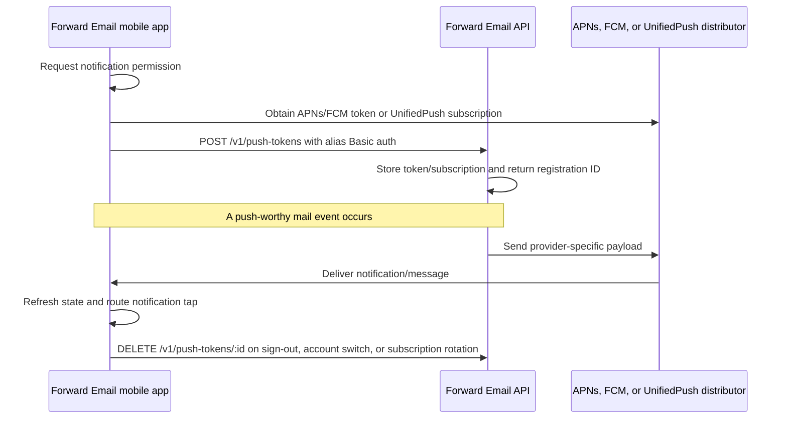

# Push Notifications Setup Guide

This document describes the Forward Email mobile push architecture and its deployment requirements. The native transports are **APNs on iOS**, **UnifiedPush on every Android build**, and optional **FCM on Google Play builds**. Desktop and browser builds support local notification display but do not register a remote push subscription.

## Support and permission matrix

| Target or profile     | Remote transport                     | Local display                                                | Build and permission source                                                                                                | Status                                             |
| --------------------- | ------------------------------------ | ------------------------------------------------------------ | -------------------------------------------------------------------------------------------------------------------------- | -------------------------------------------------- |
| iOS                   | APNs                                 | Tauri notification plugin                                    | iOS-only mobile-push commands, runtime authorization, and generated iOS `aps-environment` entitlement                      | Supported                                          |
| Android, Google-free  | UnifiedPush                          | Native background notification plus foreground Tauri display | First-party UnifiedPush connector, `POST_NOTIFICATIONS`, `RECEIVE_BOOT_COMPLETED`, and Android-only UnifiedPush capability | Supported; no Firebase or Play Services dependency |
| Android, dual release | FCM plus user-selectable UnifiedPush | Tauri/native display                                         | FCM Cargo feature and generated FCM capability, plus the always-present UnifiedPush connector                              | Supported; one APK and AAB                         |
| macOS                 | None                                 | Tauri notification plugin                                    | Shared notification commands; the macOS entitlement intentionally contains no `aps-environment`                            | Local notifications only                           |
| Windows               | None                                 | Tauri notification plugin                                    | Shared notification commands                                                                                               | Local notifications only                           |
| Ubuntu/Linux          | None                                 | Desktop notification service                                 | Shared notification commands                                                                                               | Local notifications only                           |
| Browser/PWA           | None                                 | Web Notifications API                                        | Browser notification permission                                                                                            | Local notifications only; no Web Push subscription |

> **UnifiedPush is not a manifest permission.** It is a distributor-mediated Android protocol. A compatible distributor application must be installed and selected, and the backend must encrypt each message to the subscription’s endpoint and public keys.

## Architecture



UnifiedPush registration returns a serialized Web Push-compatible subscription:

```json
{
  "endpoint": "https://distributor.example/path/token",
  "keys": {
    "p256dh": "base64url-uncompressed-p256-public-key",
    "auth": "base64url-auth-secret"
  }
}
```

The backend validates and canonicalizes this structure, rejects unsafe endpoints, encrypts notification JSON with RFC 8291 Web Push encryption, and signs the request with VAPID. The Android connector decrypts the message before it reaches the application callback service.

Backend event producers call one transport-neutral notifier with one immutable `notification_id`. That notifier explicitly starts alias-scoped push delivery to every active token and publishes the same envelope to Redis for WebSocket fan-out. The API subscriber owns only socket delivery. Push therefore starts even when the alias has **zero active WebSocket clients** or no WebSocket subscriber is available; a Redis claim suppresses duplicate provider fan-out if the same immutable notification envelope is retried.

The client initializes remote push only when `alias_auth` identifies an active alias. It stores the server registration ID, deletes that exact resource before credentials are cleared, and re-registers after an account switch or provider subscription rotation. API-key-only sessions do not initialize alias-scoped remote push.

## Provider provisioning and cross-repository values

The client never receives APNs signing keys, Firebase service-account credentials, or the VAPID private key. Configure those values in `forwardemail.net` according to its [push provider setup guide](https://github.com/forwardemail/forwardemail.net/blob/master/PUSH_NOTIFICATIONS.md), then copy only the explicitly identified public client values into this repository.

### APNs and the shared Apple services key

The backend deliberately reuses its existing `APPLE_KEY_ID`, `APPLE_TEAM_ID`, and `APPLE_KEY_PATH` credentials from Sign in with Apple for APNs. Do not create or document separate APNs-specific credential variables.

| Backend variable  | Requirement                | Exact value and source                                                                                |
| ----------------- | -------------------------- | ----------------------------------------------------------------------------------------------------- |
| `APPLE_KEY_ID`    | Required for APNs          | The 10-character Key ID displayed for the Apple services `.p8` key                                    |
| `APPLE_TEAM_ID`   | Required for APNs          | The 10-character Team ID shown in Apple Developer **Membership details**                              |
| `APPLE_KEY_PATH`  | Required for APNs          | Absolute server path to the shared `.p8` file, normally `/var/www/production/AuthKey_<KEY_ID>.p8`     |
| `APNS_BUNDLE_ID`  | Required for this app      | `net.forwardemail.mail`                                                                               |
| `APNS_PRODUCTION` | Required deployment choice | `true` for TestFlight/App Store tokens; `false` for development-signed device and APNs sandbox tokens |

In [Apple Developer](https://developer.apple.com/account/resources/authkeys/list), reuse the existing key when it already has both **Sign in with Apple** and **Apple Push Notifications service (APNs)** enabled. Otherwise, an Account Holder or Admin must create or reconfigure the shared key, record its Key ID, download the `.p8` file once, and enable Push Notifications on the `net.forwardemail.mail` App ID. Regenerate the development and distribution provisioning profiles after changing the App ID capability.

The backend certificate playbook prompts for the local `.p8` path and uploads it to `/var/www/production/<local-basename>`. Set `APPLE_KEY_PATH` to that deployed path. The client repository does not receive this `.p8` file; its separate iOS signing certificate, provisioning profile, and App Store Connect values are documented in [`docs/SECRETS.md`](SECRETS.md).

### Firebase values

The Google Play build and backend sender use the same Firebase project but require different files:

| Value                         | Used by             | How to obtain and store it                                                                                                                                             |
| ----------------------------- | ------------------- | ---------------------------------------------------------------------------------------------------------------------------------------------------------------------- |
| `FCM_PROJECT_ID`              | Backend             | Firebase **Project settings → General → Project ID**; do not use the display name, project number, or application ID                                                   |
| `FCM_SERVICE_ACCOUNT_PATH`    | Backend             | Absolute path to a secret service-account JSON key authorized for FCM HTTP v1; the backend playbook installs it as `/var/www/production/firebase-service-account.json` |
| `GOOGLE_SERVICES_JSON`        | Local Play build    | Absolute local path to the Android app’s downloaded `google-services.json` client configuration                                                                        |
| `GOOGLE_SERVICES_JSON_BASE64` | GitHub Play release | Base64 encoding of that same `google-services.json`, stored as a GitHub Actions secret                                                                                 |

In the [Firebase console](https://console.firebase.google.com/), create or select the production project, register the Android application ID `net.forwardemail.mail`, and download its latest `google-services.json` from **Project settings → General → Your apps**. Enable the Firebase Cloud Messaging API. For the backend, generate a dedicated service-account JSON key from **Project settings → Service accounts** or Google Cloud IAM and grant only the permissions needed to send FCM HTTP v1 messages to that project.

> `google-services.json` is client configuration; `firebase-service-account.json` is a backend credential. They are not interchangeable. Never copy the backend service-account JSON into this repository, an APK/AAB, or GitHub Actions for the client build.

Create the Play-release secret without introducing line wrapping:

```bash
base64 < /absolute/path/google-services.json | tr -d '\n'
```

Store the result as GitHub Actions secret `GOOGLE_SERVICES_JSON_BASE64`. Local Play builds instead set `GOOGLE_SERVICES_JSON=/absolute/path/google-services.json`.

### UnifiedPush and VAPID

Generate one stable VAPID pair from the backend repository and retain it across releases:

```bash
pnpm exec web-push generate-vapid-keys
```

| Generated or chosen value | Backend setting     | Mail repository setting                                                                             |
| ------------------------- | ------------------- | --------------------------------------------------------------------------------------------------- |
| Public key                | `VAPID_PUBLIC_KEY`  | GitHub Actions variable and local build environment `VAPID_PUBLIC_KEY`                              |
| Private key               | `VAPID_PRIVATE_KEY` | Never copy to this repository, Actions, APK, AAB, or CI logs                                        |
| Contact URI               | `VAPID_SUBJECT`     | Backend only; normally `mailto:support@forwardemail.net` or an HTTPS URL controlled by the operator |

The public and private values must remain a matched pair. Changing the VAPID pair requires Android clients to create new UnifiedPush subscriptions. The public key is intentionally embedded in Android artifacts; the private key remains a backend-only production secret.

A complete backend example is:

```env
APPLE_TEAM_ID=TEAM123456
APPLE_KEY_ID=ABC123DEFG
APPLE_KEY_PATH=/var/www/production/AuthKey_ABC123DEFG.p8
APNS_BUNDLE_ID=net.forwardemail.mail
APNS_PRODUCTION=true

FCM_PROJECT_ID=forward-email-production
FCM_SERVICE_ACCOUNT_PATH=/var/www/production/firebase-service-account.json

VAPID_SUBJECT=mailto:support@forwardemail.net
VAPID_PUBLIC_KEY=BN...
VAPID_PRIVATE_KEY=...
```

The UnifiedPush sender treats HTTP `404` and `410` responses as permanently invalid subscriptions and participates in the existing failure-count and token-pruning lifecycle. Retryable provider or network failures retain the subscription for later delivery.

## iOS application and signing configuration

The bundle identifier is `net.forwardemail.mail`. Enable **Push Notifications** for that App ID and regenerate the provisioning profile. Signed device profiles must include `aps-environment`.

The shared `src-tauri/Entitlements.plist` remains free of `aps-environment` because macOS also consumes it. `scripts/inject-ios-signing.cjs` generates an iOS-only entitlement file and selects `production` for distribution exports or `development` for development-signed device builds.

Use `scripts/ios-build.sh` for signed builds. Release automation uses these Actions secrets: `APPLE_TEAM_ID`, `IOS_CERTIFICATE_BASE64`, `IOS_CERTIFICATE_PASSWORD`, `IOS_PROVISIONING_PROFILE_BASE64`, `APP_STORE_CONNECT_API_KEY`, `APP_STORE_CONNECT_KEY_ID`, and `APP_STORE_CONNECT_ISSUER_ID`.

## Android UnifiedPush configuration

The first-party Tauri plugin under `src-tauri/plugins/tauri-plugin-unified-push` uses the stable UnifiedPush Android connector. It performs distributor discovery, explicit user-driven distributor selection, VAPID-bound registration, callback persistence, subscription rotation, message acknowledgment, foreground event forwarding, and background native notification display.

A user needs a compatible UnifiedPush distributor. After installing one, the user can open Forward Email settings and select or change the distributor. In the dual-provider APK, FCM is the default until the user makes that explicit choice; the selected UnifiedPush preference then persists across application restarts and is attempted before FCM. The application opens the distributor picker only from the explicit settings action.

The client queues messages received while the webview is unavailable. It drains them on initialization and marks notifications already displayed by Android so the frontend can refresh mailbox state without displaying a duplicate notification.

### Build profiles

| Profile     | Command                           | Native content                                                                                                                            | Intended distribution                                                     |
| ----------- | --------------------------------- | ----------------------------------------------------------------------------------------------------------------------------------------- | ------------------------------------------------------------------------- |
| Google-free | `pnpm tauri:android:build:fdroid` | UnifiedPush only; no Firebase Gradle plugin, Firebase Messaging library, FCM service, generated FCM capability, or `google-services.json` | F-Droid, direct APK, alternative stores, and privacy-focused distribution |
| Play        | `pnpm tauri:android:build:play`   | UnifiedPush plus FCM; runtime defaults to FCM and honors a durable user-selected UnifiedPush distributor                                  | Single GitHub release APK/AAB and Google Play                             |
| Default     | `pnpm tauri:android:build`        | Same as Google-free                                                                                                                       | Safe default for downstream packagers                                     |

Development equivalents are `pnpm tauri:android:dev:fdroid` and `pnpm tauri:android:dev:play`.

Every profile that contains UnifiedPush requires the public key at build time. This is the Forward Email application server's public VAPID identity, not a distributor setting and not a value entered by end users. Android users choose or change any installed UnifiedPush distributor through the system picker in Settings; the private VAPID key remains only on the matching Forward Email backend.

```bash
VAPID_PUBLIC_KEY='BN...' \
  pnpm tauri:android:build:fdroid -- --apk
```

For a Play dual-provider build, also supply Firebase configuration:

```bash
VAPID_PUBLIC_KEY='BN...' \
GOOGLE_SERVICES_JSON=/absolute/path/google-services.json \
  pnpm tauri:android:build:play -- --aab
```

`scripts/configure-android-push.cjs` is idempotent. It removes stale Firebase files, Gradle declarations, manifest services, and generated FCM capabilities before applying the selected profile. This prevents a previous Play build from contaminating a later F-Droid artifact.

### Continuous integration and releases

Store `VAPID_PUBLIC_KEY` as a GitHub Actions **variable**. Its value must exactly equal backend `VAPID_PUBLIC_KEY`. Store `GOOGLE_SERVICES_JSON_BASE64` as a `release` environment **secret**. Both are required by the fail-fast preflight for the single dual-provider release.

The release workflow creates exactly one signed dual-provider APK and one matching AAB. It uploads that AAB to Google Play when the Play service-account secret is configured. Routine Android CI and emulator E2E builds retain Google-free coverage so the first-party connector continuously compiles without Firebase or Google Play Services.

For F-Droid metadata or other reproducible Google-free downstream builds, invoke the default or `:fdroid` command and set `VAPID_PUBLIC_KEY` in the controlled build environment. No proprietary Firebase artifact or Firebase secret is required for that profile, and it is intentionally not published as a second GitHub release APK.

## Authentication and token lifecycle

The push-token endpoint requires alias-scoped HTTP Basic credentials. Registration is rejected when alias credentials are missing or ambiguous. The client never sends provider credentials; it sends only an APNs/FCM token or a UnifiedPush subscription.

On sign-out, account replacement, provider change, registration failure, or endpoint rotation, the client deletes the old backend registration where possible and unregisters native listeners/subscriptions as appropriate. Instance identifiers prevent callbacks from an obsolete UnifiedPush registration from replacing the active subscription.

## Validation and device smoke tests

| Validation                   | Expected result                                                                                                     |
| ---------------------------- | ------------------------------------------------------------------------------------------------------------------- |
| Google-free dependency audit | Built dependency graph contains UnifiedPush connector but no Firebase Messaging or Play Services push dependency    |
| Profile-switch test          | Running Play configuration and then Google-free configuration removes all Firebase files and declarations           |
| UnifiedPush registration     | Settings shows the selected distributor and backend stores a complete serialized subscription                       |
| Encrypted delivery           | A backend event reaches the distributor and is decrypted by the connector without plaintext provider payloads       |
| Background receipt           | Android displays one `new-mail` notification while the webview is suspended                                         |
| Foreground receipt           | Mailbox state refreshes and only one notification is displayed                                                      |
| Subscription rotation        | Old backend registration is deleted and the replacement subscription becomes active                                 |
| Permanent endpoint failure   | `404` or `410` increments/prunes the obsolete registration through the normal failure lifecycle                     |
| Sign-out/account switch      | Existing server registration, native listeners, and provider state are cleaned up before new credentials initialize |
| Dual-provider release        | One APK contains FCM and UnifiedPush; an explicit distributor choice persists and takes precedence after restart    |
| iOS/macOS entitlement split  | iOS signed build has `aps-environment`; shared macOS entitlement does not                                           |

Physical-device tests should cover at least one distributor from the intended F-Droid ecosystem, Android 13+ notification permission, process termination/restart, distributor replacement, network loss, account switch, and notification tap routing. A successful compile alone does not validate distributor behavior.
