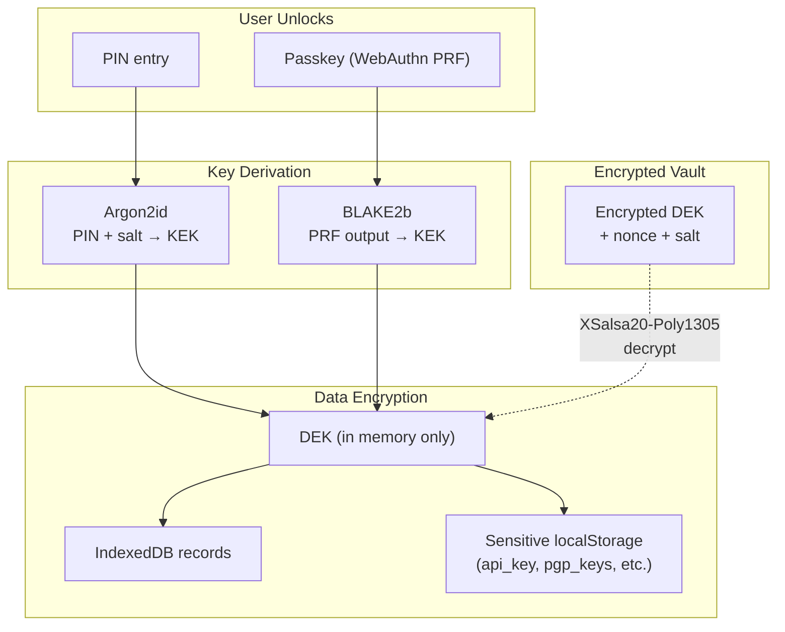
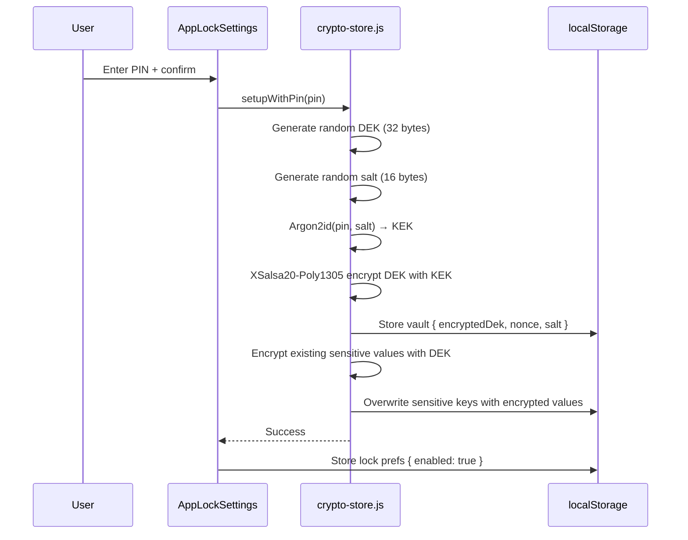
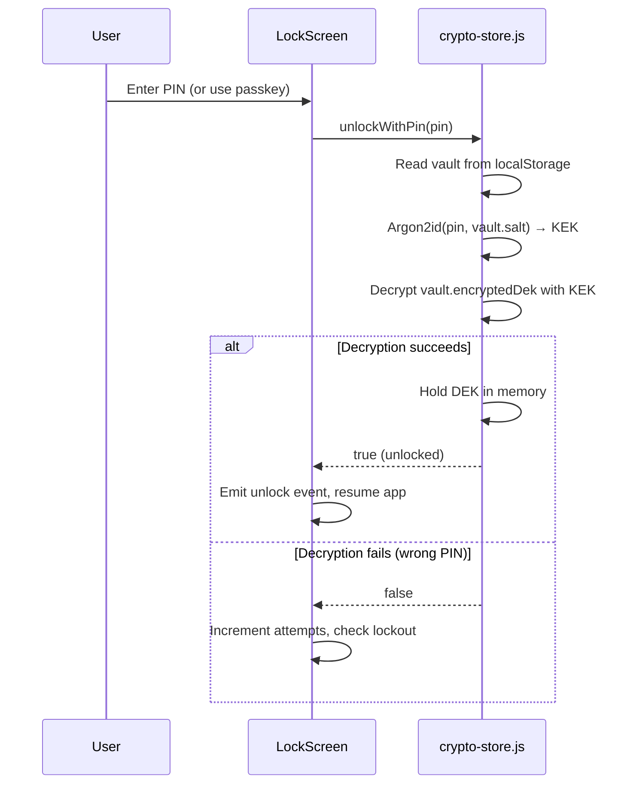

# App Lock Architecture

Client-side encryption and authentication system that protects all locally
stored data with a user-chosen PIN or passkey. When enabled, email bodies,
credentials, and PGP keys are encrypted at rest in the browser.

## Design Goals

1. **Device-level protection** — A single lock protects all accounts in the
   browser, similar to a phone lock screen.
2. **Zero server knowledge** — Encryption keys never leave the client. The
   server cannot decrypt locally cached data.
3. **Envelope encryption** — A random Data Encryption Key (DEK) encrypts
   data; the DEK itself is wrapped by a Key Encryption Key (KEK) derived
   from the user's PIN or passkey.
4. **Passkey-first optional** — Users can register a WebAuthn passkey
   (Touch ID, Face ID, YubiKey, etc.) as an alternative to their PIN.

## Cryptographic Design



### Key Hierarchy

| Layer           | Algorithm                      | Purpose                                              |
| --------------- | ------------------------------ | ---------------------------------------------------- |
| KEK (PIN)       | Argon2id (memory=64 MB, ops=3) | Derives key-encryption key from user PIN             |
| KEK (Passkey)   | BLAKE2b-256                    | Derives key-encryption key from WebAuthn PRF output  |
| DEK wrapping    | XSalsa20-Poly1305 (libsodium)  | Encrypts/decrypts the DEK with the KEK               |
| Data encryption | XSalsa20-Poly1305 (libsodium)  | Encrypts IndexedDB values and sensitive localStorage |

### Encrypted Value Format

Encrypted values are prefixed with a magic header to distinguish them from
plaintext, allowing safe handling during migrations:

```
\x00ENC\x01 || nonce (24 bytes) || ciphertext
```

## Storage Layout

All app lock state is stored in `localStorage` with fixed (non-account-scoped)
keys. This is intentional — the lock protects the **device**, not individual
accounts.

| Key                               | Content                                                               | Encrypted?                   |
| --------------------------------- | --------------------------------------------------------------------- | ---------------------------- |
| `webmail_lock_prefs`              | JSON: `{ enabled, timeoutMs, lockOnMinimize, pinLength, hasPasskey }` | No                           |
| `webmail_crypto_vault`            | JSON: `{ encryptedDek, nonce, salt, version, createdAt }`             | N/A (contains encrypted DEK) |
| `webmail_passkey_credential`      | JSON: `{ id, publicKey, algorithm, transports, registeredAt }`        | No                           |
| `webmail_passkey_prf_salt`        | Base64url 32-byte salt for PRF input                                  | No                           |
| `webmail_api_key`                 | API key                                                               | Yes (when lock enabled)      |
| `webmail_alias_auth`              | Alias auth token                                                      | Yes (when lock enabled)      |
| `webmail_authToken`               | Session auth token                                                    | Yes (when lock enabled)      |
| `webmail_pgp_keys_{email}`        | PGP private keys                                                      | Yes (when lock enabled)      |
| `webmail_pgp_passphrases_{email}` | PGP passphrases                                                       | Yes (when lock enabled)      |

## Lifecycle

### Enable App Lock



### Unlock Flow



### Auto-Lock (Inactivity Timer)

The inactivity timer (`src/utils/inactivity-timer.js`) monitors user activity
and locks the app after a configurable period:

- **Activity events**: mousedown, mousemove, keydown, keypress, touchstart,
  touchmove, scroll, wheel, pointerdown
- **Throttled**: Activity detection is throttled to 1 check per second
- **Lock on minimize**: Optional — locks when `document.hidden` becomes true
  or Tauri window loses focus
- **Timer reset**: Any activity event resets the countdown

When the timer fires, `crypto-store.lock()` is called which:

1. Zeros out the in-memory DEK
2. Triggers the lock screen UI

### Lockout Protection

The lock screen implements progressive lockout after failed attempts:

| Attempts | Lockout Duration             |
| -------- | ---------------------------- |
| 1–4      | None                         |
| 5        | 30 seconds                   |
| 6        | 1 minute                     |
| 7        | 5 minutes                    |
| 8        | 15 minutes                   |
| 9        | 30 minutes                   |
| 10+      | Permanent (restart required) |

Lockout state is persisted in `localStorage` to survive page refreshes.
Both PIN and passkey failures count toward the same attempt counter.

## Passkey Integration

Passkeys use the [WebAuthn PRF extension](https://w3c.github.io/webauthn/#prf-extension)
to derive encryption keys directly from the authenticator during the
authentication ceremony. This provides:

- **Passwordless unlock**: No PIN required if a passkey is registered
- **Hardware-bound keys**: The PRF output depends on the authenticator's
  internal secret, so it cannot be extracted or replayed
- **Biometric gating**: Touch ID, Face ID, etc. protect the passkey

### PRF Flow

**Registration (two-step):**

1. A 32-byte random salt is generated and stored in `webmail_passkey_prf_salt`
2. The credential is created via WebAuthn `create()` with the PRF extension
   enabled (so the authenticator knows to support PRF for this credential)
3. Immediately after registration, the app calls WebAuthn `get()` (authenticate)
   with the new credential to obtain the PRF output. This is necessary because
   PRF outputs are only returned during authentication, not registration.
4. The PRF output is hashed with BLAKE2b-256 to produce the KEK
5. The KEK wraps the vault's DEK

**Unlock:**

1. The salt is passed as the PRF `eval.first` input with the label
   `'ForwardEmail-AppLock-PRF-v1'`
2. The authenticator returns a 32-byte PRF output
3. The PRF output is hashed with BLAKE2b-256 to produce the KEK
4. The KEK decrypts the vault's DEK, same as the PIN path

### Browser Support

The PRF extension requires:

- Chrome 116+ / Edge 116+ with a platform authenticator
- Safari 18+ (macOS Sequoia, iOS 18)
- Firefox: not yet supported

The UI checks `isPrfSupported()` before showing the passkey option and falls
back to PIN-only mode gracefully.

## Source Files

| File                                | Responsibility                                       |
| ----------------------------------- | ---------------------------------------------------- |
| `src/utils/crypto-store.js`         | Vault management, encryption/decryption, lock/unlock |
| `src/utils/passkey-auth.js`         | WebAuthn registration, authentication, PRF handling  |
| `src/utils/inactivity-timer.js`     | Activity monitoring, auto-lock trigger               |
| `src/svelte/AppLockSettings.svelte` | Settings UI (enable, PIN, passkey, timeout)          |
| `src/svelte/LockScreen.svelte`      | Lock screen UI (PIN entry, passkey button, lockout)  |

## Security Considerations

- **DEK never persisted in plaintext** — Only the encrypted DEK is stored.
  The plaintext DEK exists only in JavaScript memory while the app is unlocked.
- **Argon2id parameters** — 64 MB memory, 3 iterations. High enough to resist
  brute-force on a stolen `localStorage` dump while remaining fast on modern
  devices (~200 ms).
- **No server round-trip** — Lock/unlock is entirely client-side. A compromised
  server cannot bypass the app lock.
- **CSP requirement** — `'wasm-unsafe-eval'` is required in `script-src` for
  the libsodium and hash-wasm WebAssembly modules used by the crypto operations.
- **Global scope** — The lock is device-level, not per-account. All accounts
  in the browser share the same PIN/passkey. This mirrors the mental model of
  a device lock screen and avoids the complexity of per-account key management.
