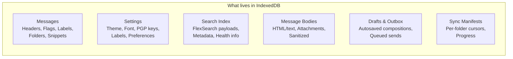
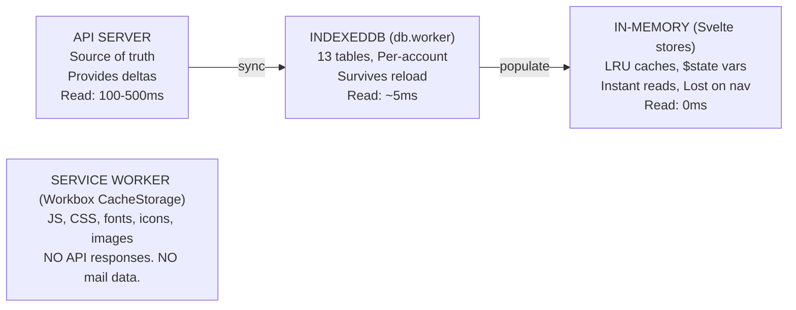
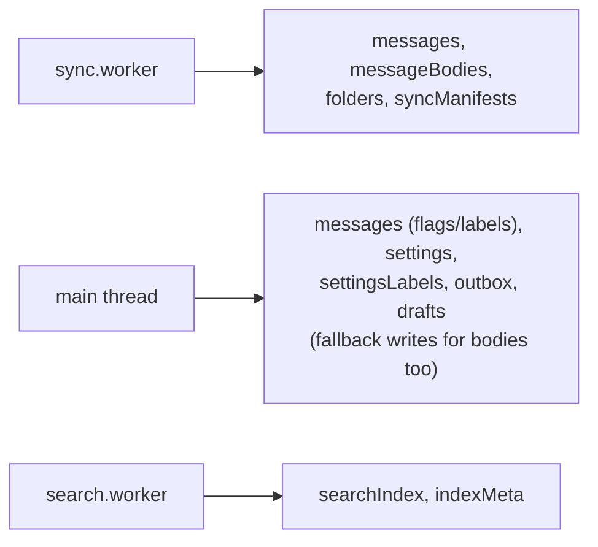
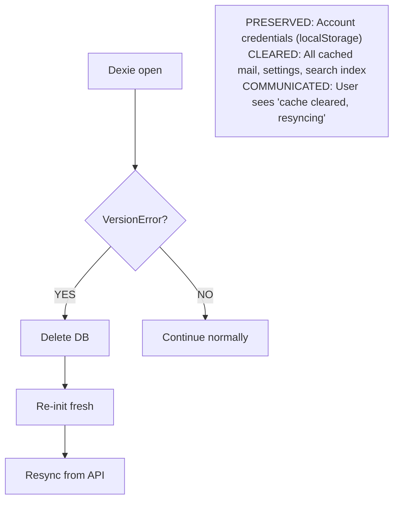
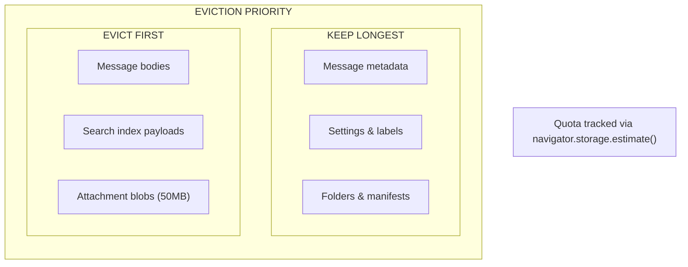

# Building Webmail: The Data Layer

IndexedDB is not a cache here — it IS the product. The schema, upgrade
strategy, and recovery paths define whether offline-first feels solid or
fragile.

## Why IndexedDB Is Product Memory

The UI reads from local storage first. The API only supplies deltas. That means
IndexedDB holds everything the user expects to see immediately:

## Database Schema

Database: `webmail-cache-v1` (prod) / `webmail-cache-dev` (dev)
Schema version: `1` (defined in `src/utils/db-constants.ts`)

| Table          | Primary Key      | Purpose                   |
| -------------- | ---------------- | ------------------------- |
| accounts       | id               | Account registry          |
| folders        | [account+path]   | Cached folder tree        |
| messages       | [account+id]     | Message headers + flags   |
| messageBodies  | [account+id]     | Parsed HTML/text bodies   |
| drafts         | [account+id]     | Autosaved drafts          |
| outbox         | [account+id]     | Queued outgoing mail      |
| syncManifests  | [account+folder] | Per-folder sync cursors   |
| labels         | [account+id]     | User-defined labels       |
| settings       | account          | Account preferences       |
| settingsLabels | account          | Label definitions         |
| searchIndex    | [account+key]    | FlexSearch payloads       |
| indexMeta      | [account+key]    | Search index metadata     |
| meta           | key              | Key-value store (generic) |

### Key Indexes on `messages`

The schema is designed to make these reads fast:

| Index                            | Used For                   |
| -------------------------------- | -------------------------- |
| [account+folder]                 | List messages in a folder  |
| [account+folder+date]            | Sort by date within folder |
| [account+folder+is_unread_index] | Filter unread in folder    |
| [account+id]                     | Look up specific message   |

### The `meta` Table: Swiss Army Knife

The `meta` table is a generic key-value store that avoids schema migrations for
new features:

| Key Pattern    | Used By                            |
| -------------- | ---------------------------------- |
| mutation-queue | Offline mutation queue             |
| contacts:\*    | Contact autocomplete cache         |
| attachment:\*  | Attachment blob cache (50MB quota) |

## Storage Layers

Data flows through three layers, each with different speed and durability:

## Read Patterns

```mermaid
flowchart TD
    subgraph MAILBOX LIST
        ML1["1. Check in-memory LRU (0ms)"] --> ML2["2. Query messages by<br/>[account+folder+date] (5ms)"] --> ML3["3. Fetch API delta if stale<br/>(100-500ms, background)"]
    end

    subgraph MESSAGE DETAIL
        MD1["1. Check messageBodies by<br/>[account+id] (5ms)"] --> MD2["2. Fetch from API if missing<br/>(200-800ms)"] --> MD3["3. Parse, sanitize, cache<br/>(background)"]
    end

    subgraph SEARCH
        S1["1. Query FlexSearch index (instant)"] --> S2["2. Health check vs DB count (startup)"] --> S3["3. Rebuild if diverged (background)"]
    end

    subgraph SETTINGS & LABELS
        SL1["1. Read settings at boot (fast hydration)"] --> SL2["2. Sync with API (background)"]
    end
```

## Write Patterns

## Version Management

All version numbers are centralized:

| File                        | Variable                 | Purpose                                              |
| --------------------------- | ------------------------ | ---------------------------------------------------- |
| `src/utils/db-constants.ts` | `SCHEMA_VERSION`         | Single source of truth for DB schema                 |
| `src/workers/db.worker.ts`  | uses `SCHEMA_VERSION`    | Applies schema via `this.version(...).stores({...})` |
| `src/utils/db.js`           | imports `SCHEMA_VERSION` | Main thread access                                   |
| `public/sw-sync.js`         | must match               | Raw IDB access in service worker                     |

## Upgrade Strategy

Schema changes happen inside `db.worker` and are versioned. Every update must:

1. Add new tables/indexes without breaking existing reads
2. Keep migrations minimal — data ops, not runtime patches
3. Increment `SCHEMA_VERSION` in `db-constants.ts`
4. Ensure `sw-sync.js` stays in sync

## Recovery Strategy

## Cache Eviction

## Troubleshooting

| Symptom                  | Check                                            |
| ------------------------ | ------------------------------------------------ |
| Empty inbox after reload | Is db.worker initialized? Check `messages` table |
| Search returns nothing   | Check `searchIndex` rows, run health check       |
| Stale data after sync    | Check `syncManifests` for cursor progress        |
| Blank settings on login  | Verify `settings` table has rows for account     |
| "Database blocked" error | Schema version mismatch — clear and re-init      |

---

**Next:** [Search Engine](building-webmail-search.md) — local-first full-text
search with FlexSearch.
