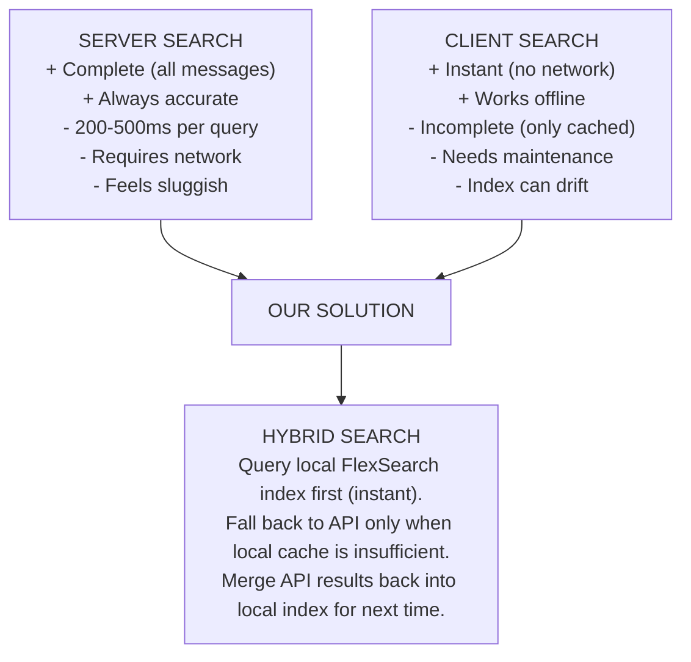
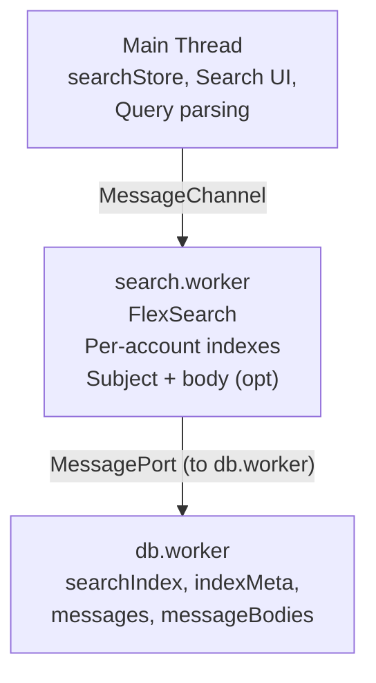
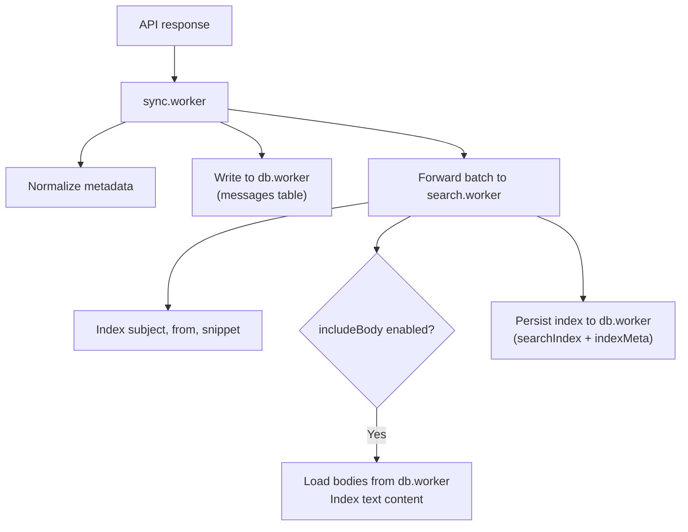
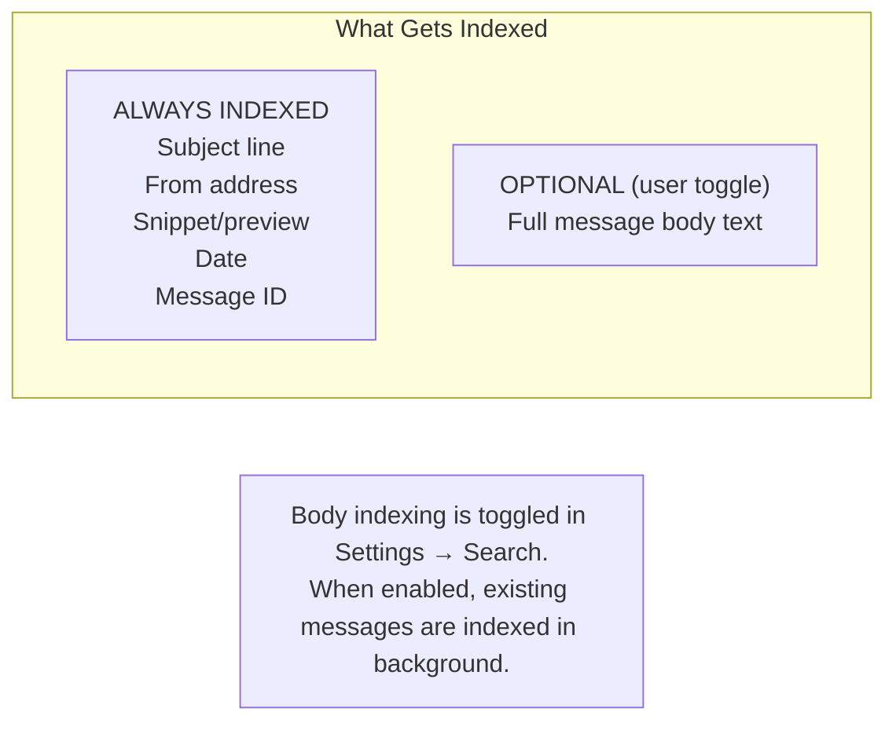
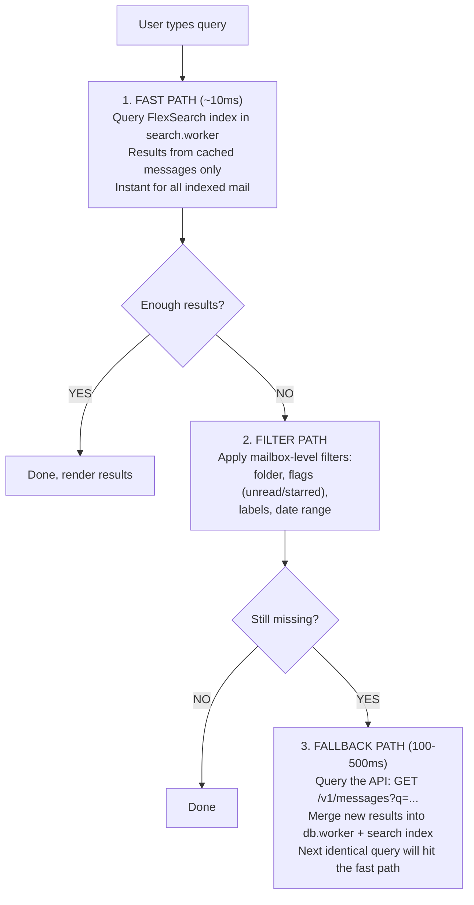
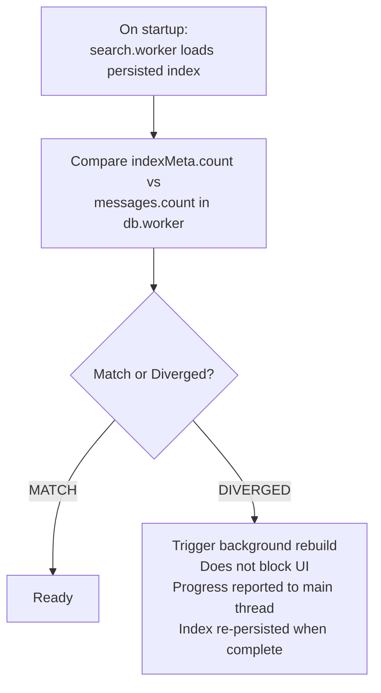

# Building Webmail: The Search Engine

Search is the fastest way users navigate a mailbox. It has to be instant,
offline-capable, and reliable — even as the mailbox grows to thousands of
messages. That makes search a core system, not a feature.

## The Problem

## Architecture

## Indexing Pipeline

New messages flow through a pipeline from API to searchable index:

### What Gets Indexed

## Query Model

Three paths, fastest first:

### Advanced Query Syntax

| Filter         | Example                 |
| -------------- | ----------------------- |
| from:          | from:alice@example.com  |
| to:            | to:bob@example.com      |
| subject:       | subject:meeting notes   |
| before:        | before:2025-01-01       |
| after:         | after:2024-06-15        |
| has:attachment | has:attachment          |
| is:unread      | is:unread               |
| is:starred     | is:starred              |
| label:         | label:important         |
| free text      | quarterly report budget |

## Index Health & Rebuilds

Indexes drift. Messages get synced, evicted, or updated. We track this
explicitly and heal automatically:

## Key Source Files

| File                                | Role                                |
| ----------------------------------- | ----------------------------------- |
| `src/workers/search.worker.ts`      | FlexSearch owner, indexing, queries |
| `src/utils/search-worker-client.js` | Main thread proxy to search.worker  |
| `src/utils/search-service.js`       | Query execution and fallback        |
| `src/utils/search-query.js`         | Query parsing and filter logic      |
| `src/stores/searchStore.ts`         | Search UI state, health monitoring  |

---

**Next:** [Service Worker & Offline Patterns](building-webmail-service-worker.md)
— cache the shell, queue the mutations.
