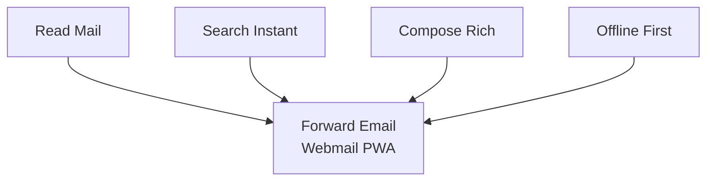
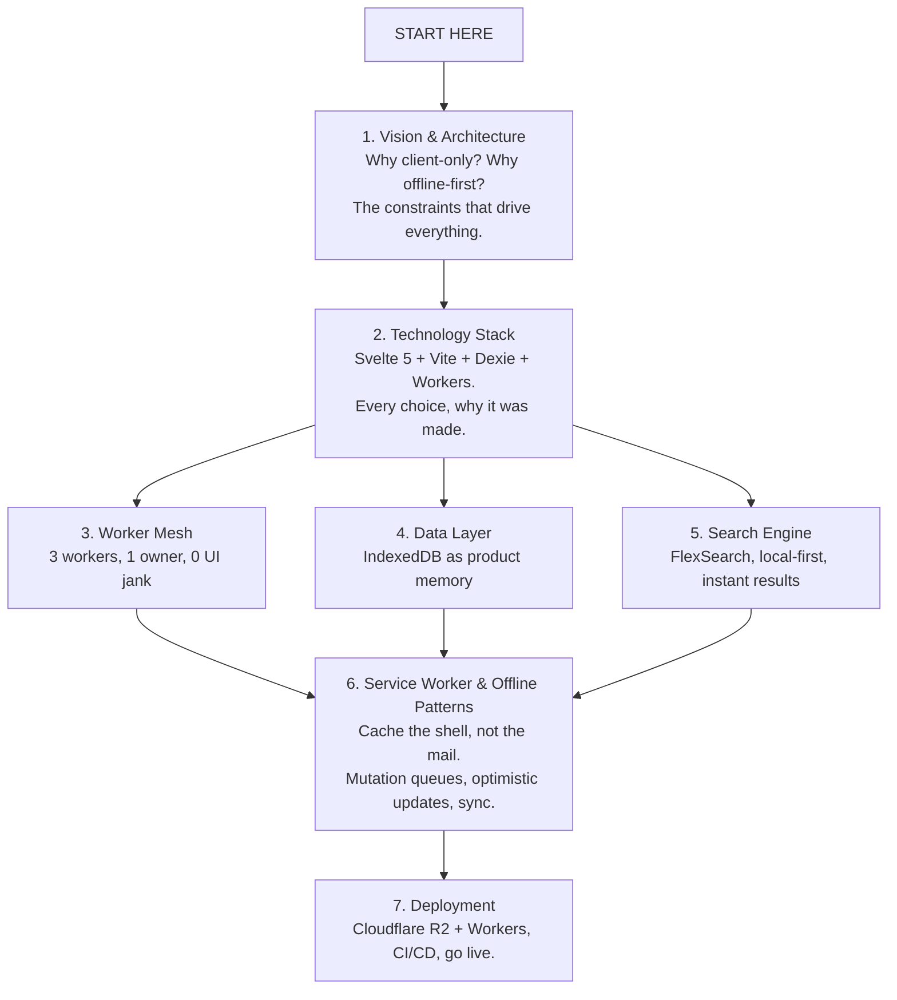
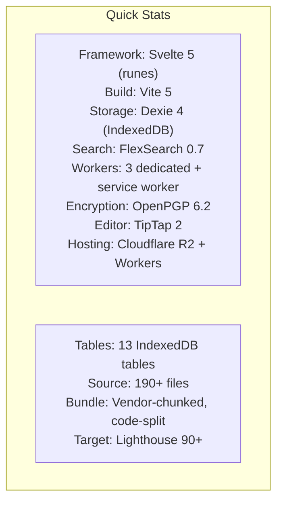

# Building Webmail

A technical deep-dive into how we built a privacy-first, offline-capable webmail
PWA that runs entirely in the browser.

## The Series

## Reading Guide

| You want to...                       | Start here                                                              |
| ------------------------------------ | ----------------------------------------------------------------------- |
| Understand the big picture           | [Vision & Architecture](building-webmail-vision-architecture.md)        |
| Know why we picked Svelte/Dexie/etc  | [Technology Stack](building-webmail-technology-stack.md)                |
| Understand off-main-thread design    | [Worker Mesh](building-webmail-workers.md)                              |
| Debug cache or IndexedDB issues      | [Data Layer](building-webmail-db-schema-recovery.md)                    |
| Trace a search query end-to-end      | [Search Engine](building-webmail-search.md)                             |
| Understand offline and sync patterns | [Service Worker & Offline Patterns](building-webmail-service-worker.md) |
| Ship to production                   | [Deployment](deployment-checklist.md)                                   |

## Detailed References

These go deeper than the series articles:

| Document                                                        | Scope                                              |
| --------------------------------------------------------------- | -------------------------------------------------- |
| [Worker Architecture](worker-architecture.md)                   | Message contracts, data flows, fallback paths      |
| [Cache & Indexing Architecture](cache-indexing-architecture.md) | Storage layers, eviction, reconciliation           |
| [Mailbox Loading Flow](mailbox-loading-flow.md)                 | Full request lifecycle with timeline visualization |

## Quick Stats

