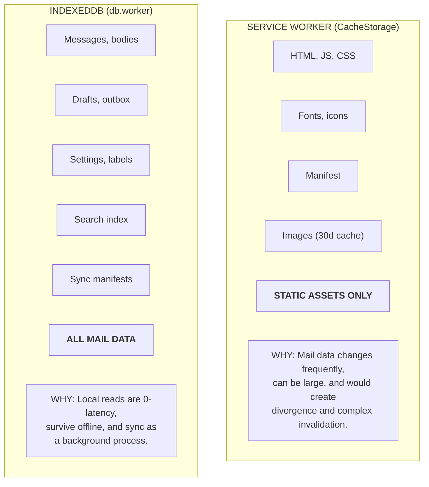
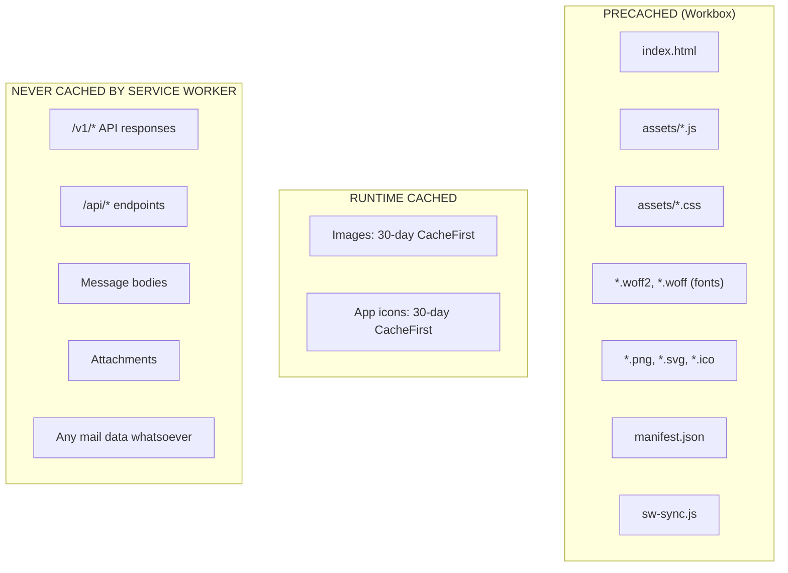
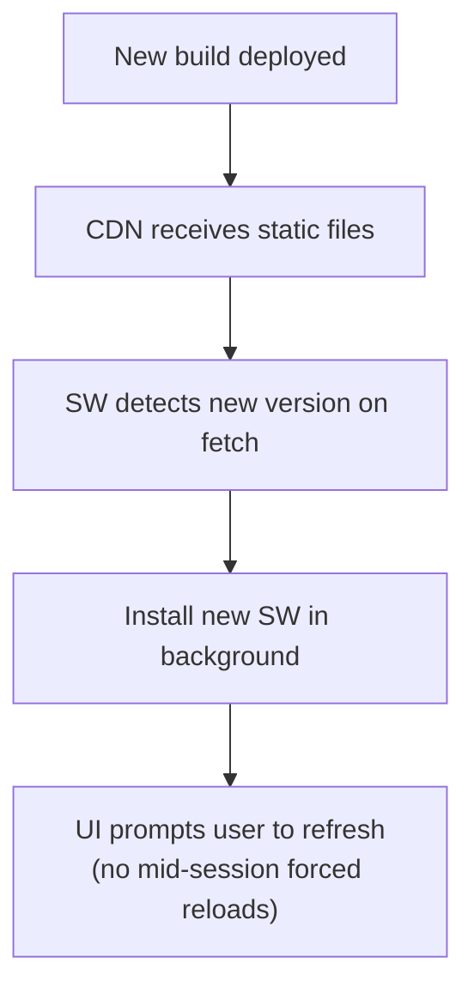
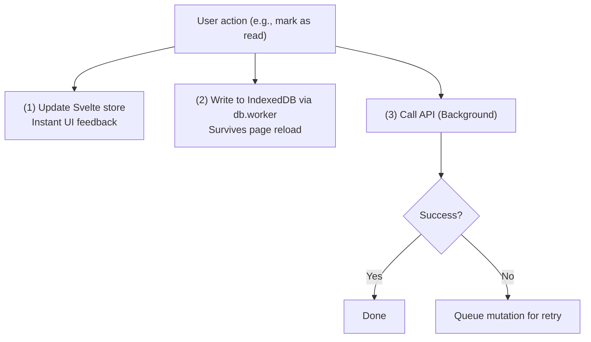
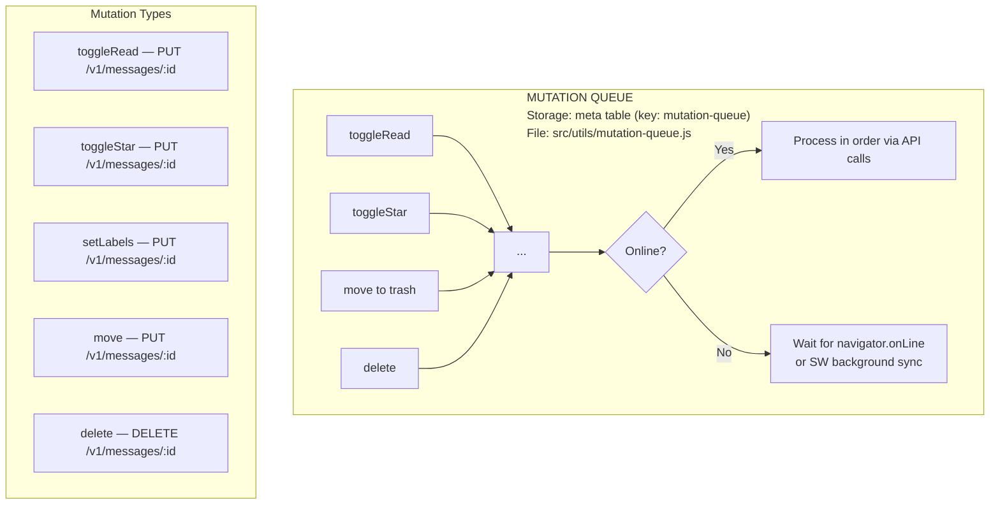
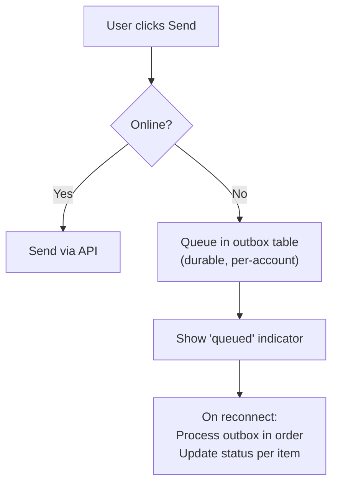
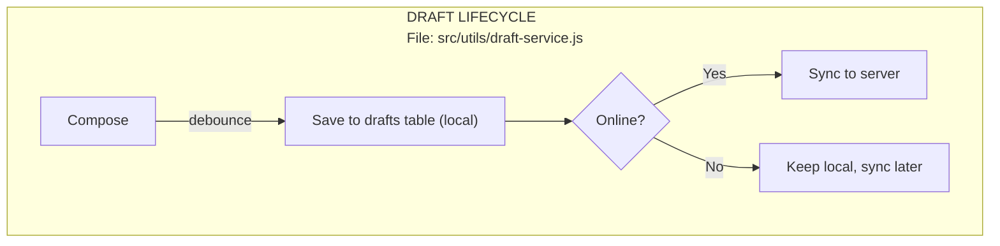
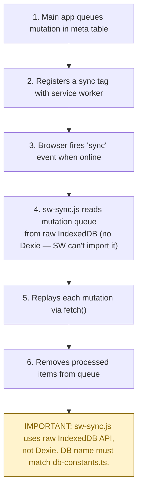
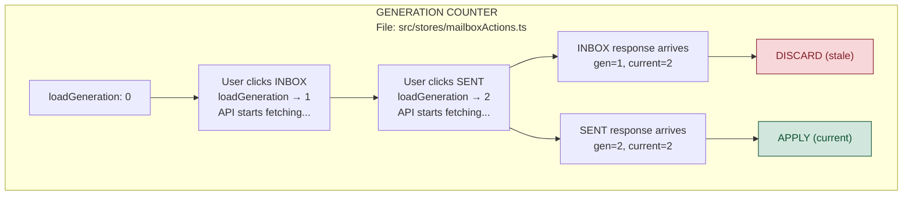
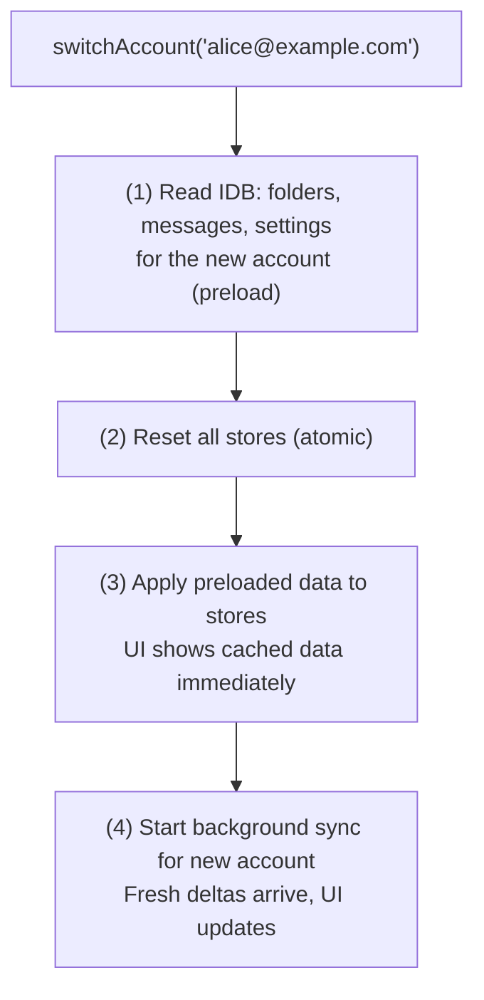

# Building Webmail: Service Worker & Offline Patterns

A service worker is essential for a PWA, but it is not a data store. Our rule:
**cache the shell, not the mail.** The real offline magic happens in IndexedDB
with optimistic updates, mutation queues, and background sync.

## The Separation

## Service Worker Strategy

### What Gets Cached

### Update Model

## Offline-First Patterns

The service worker handles the app shell. Everything below handles the data.

### Pattern 1: Optimistic Updates

Apply changes to the local store and IndexedDB immediately. Sync with the API
in the background. If the API call fails, queue for retry.

**Key:** We never revert the optimistic update. On failure, the mutation goes
into a durable queue and retries when the network returns.

### Pattern 2: Mutation Queue

Failed API calls are persisted in the `meta` table under the `mutation-queue`
key. The queue is durable across page reloads and processed in order.

### Pattern 3: Outbox (Offline Send)

Composed emails are queued in the `outbox` table when offline and sent when the
network returns.

### Pattern 4: Draft Autosave

Drafts are saved to IndexedDB automatically as the user composes, protecting
against browser crashes and network loss.

### Pattern 5: Background Sync (Service Worker)

The service worker (`sw-sync.js`) can replay queued actions when the browser
regains connectivity — even if the tab is closed.

### Pattern 6: Generation Counter

Prevents stale API responses from overwriting fresh data when the user
switches folders or accounts rapidly.

### Pattern 7: Atomic Account Switch

When switching accounts, we preload the new account's cache from IndexedDB
before resetting stores — avoiding a blank flash.

## Key Source Files

| File                           | Role                                |
| ------------------------------ | ----------------------------------- |
| `src/utils/mutation-queue.js`  | Offline mutation queue (meta table) |
| `src/utils/outbox-service.js`  | Offline email send queue            |
| `src/utils/draft-service.js`   | Draft autosave and sync             |
| `src/utils/sync-controller.js` | Sync orchestration and scheduling   |
| `src/utils/cache-manager.js`   | Cache lifecycle and eviction        |
| `public/sw-sync.js`            | Service worker background sync      |
| `workbox.config.cjs`           | Workbox precaching configuration    |

---

**Next:** [Deployment](deployment-checklist.md) — ship to Cloudflare R2 + Workers.
