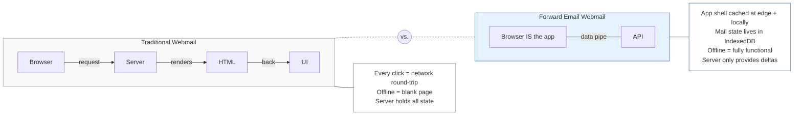
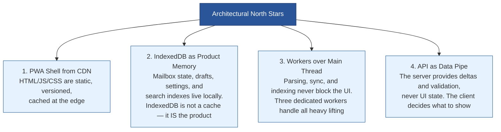
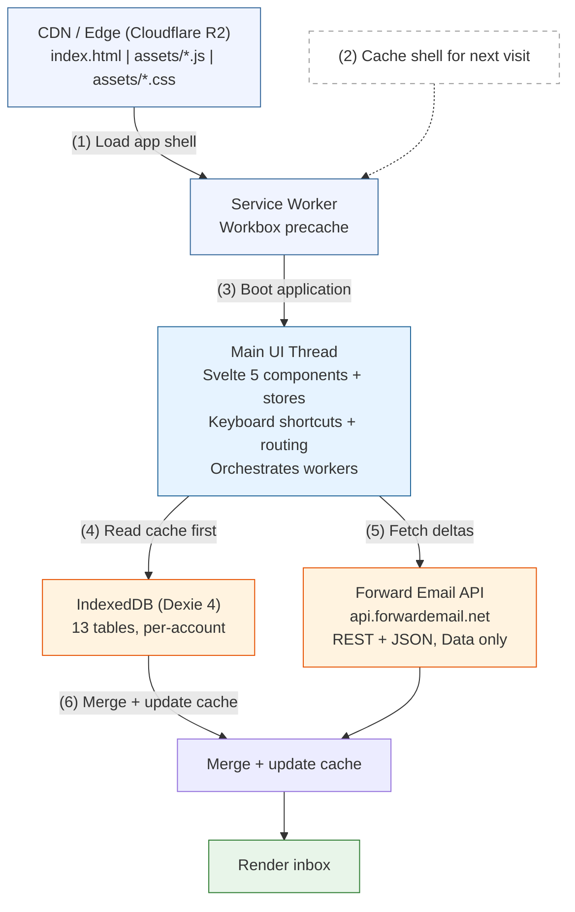
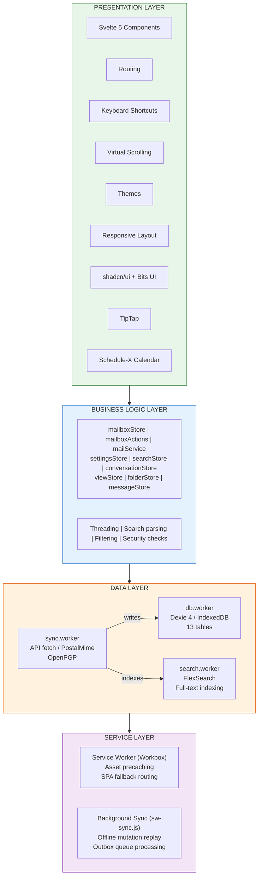
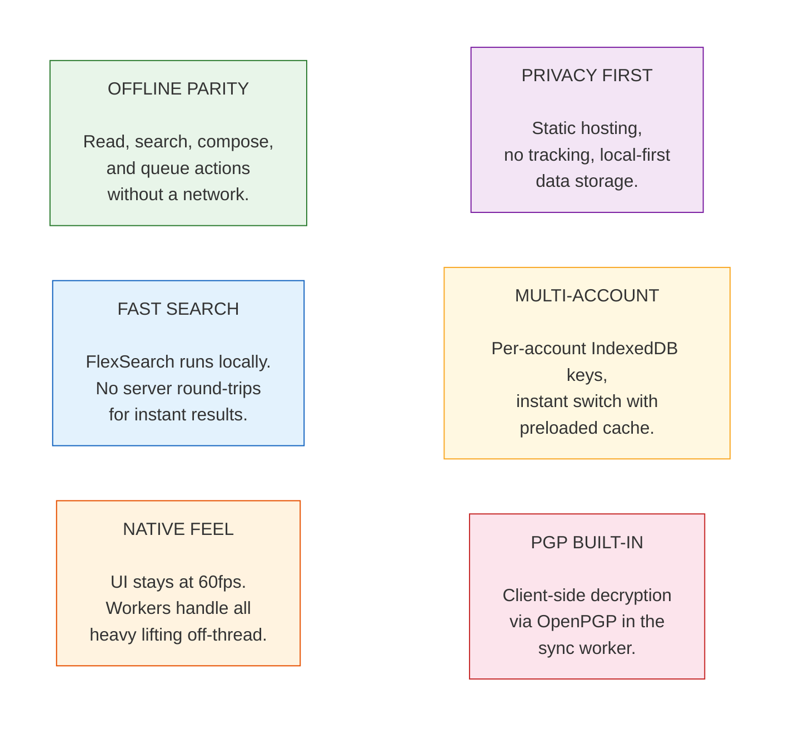

# Building Webmail: Vision & Architecture

> A privacy-first, offline-capable webmail client that runs entirely in the
> browser and stores mailbox state locally.

## Why This Exists

Most webmail is server-driven: HTML rendered remotely, thin browser caches, and
features that disappear when the network stalls. We took the opposite bet.

## Architectural North Stars

These are the constraints we refuse to break:

## How a Request Flows

From cold start to rendered inbox in under 200ms (cached):

## Layered Architecture

## What This Unlocks

## Key Design Decisions

| Decision                    | Why                                                    |
| --------------------------- | ------------------------------------------------------ |
| Client-only PWA             | No server-rendered UI = immutable, globally fast       |
| IndexedDB over server state | Local reads are 0-latency, survive offline             |
| Workers for all heavy work  | UI thread stays free, 60fps guaranteed                 |
| Optimistic updates          | Apply locally first, sync API in background            |
| Generation counters         | Prevent stale API responses from clobbering fresh data |
| Leading-edge debounce       | Account switches feel instant, last one wins           |
| Atomic cache swap           | Read IDB before resetting stores = no blank flash      |
| Vendor chunk splitting      | Core deps cached separately from app code              |
| Lazy-loaded routes          | Calendar, contacts, compose load on demand             |

## The Bet

If we get the architecture right, everything else scales: faster UX, better
privacy, richer features, and a codebase that ships as a PWA today and wraps
as a native app tomorrow. The constraint is the advantage.

---

**Next:** [Technology Stack](building-webmail-technology-stack.md) — the tools
that make this constraint real.
