# Building Webmail: The Worker Mesh

Offline-first webmail is a concurrency problem. Message parsing, API sync, and
full-text indexing are too heavy for the main thread. The solution: a worker
mesh with clear ownership boundaries and zero shared state.

## The Golden Rule

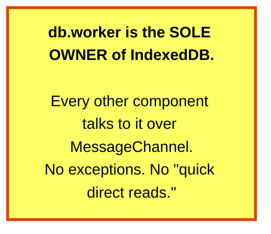

This avoids lock contention, prevents version conflicts, and gives us a single
place to version and migrate the schema.

## The Architecture

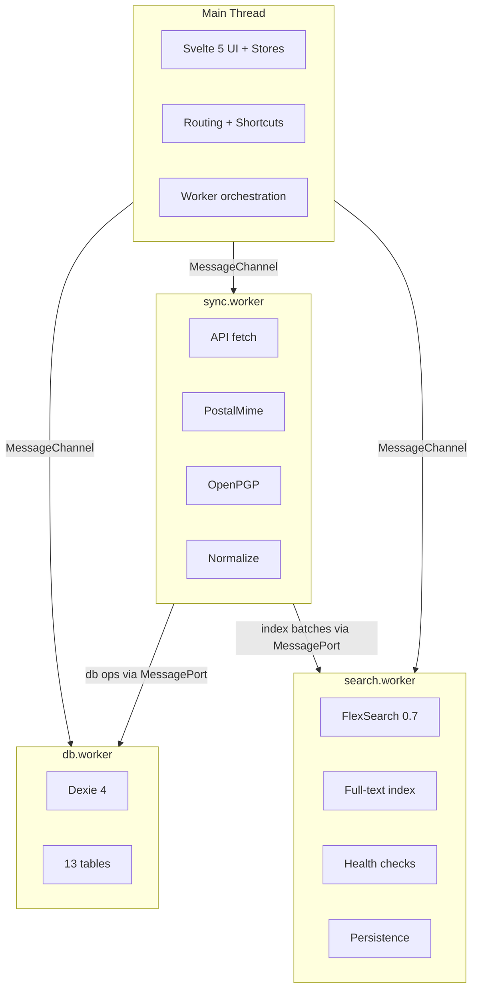

## Worker Responsibilities

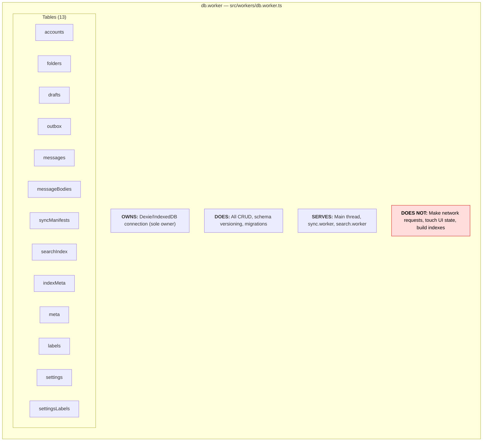

```mermaid
flowchart TB
    subgraph syncworker["sync.worker — src/workers/sync.worker.ts"]
        direction TB
        SW_OWNS["<b>OWNS:</b> API synchronization, message parsing pipeline"]
        subgraph SW_DOES["DOES"]
            direction TB
            SW1["Fetch folders + message lists from REST API"]
            SW2["Normalize and enrich message metadata"]
            SW3["Parse message bodies with PostalMime"]
            SW4["PGP decryption via OpenPGP"]
            SW5["Write results to db.worker via MessagePort"]
            SW6["Forward new messages to search.worker for indexing"]
            SW7["Maintain per-folder sync manifests"]
            SW8["Emit progress events to main thread"]
        end
        SW_NOT["<b>DOES NOT:</b> Open IndexedDB, render UI, own search state"]
    end

    style SW_NOT fill:#fdd,stroke:#c00,color:#000
```

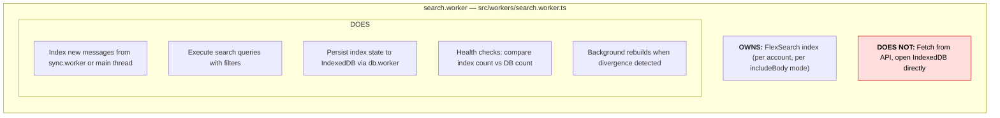

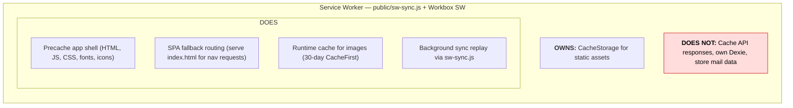

## Startup Sequence

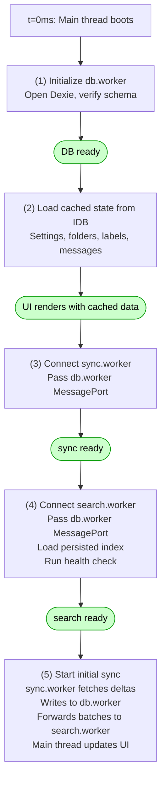

## Data Flow: Loading the Inbox

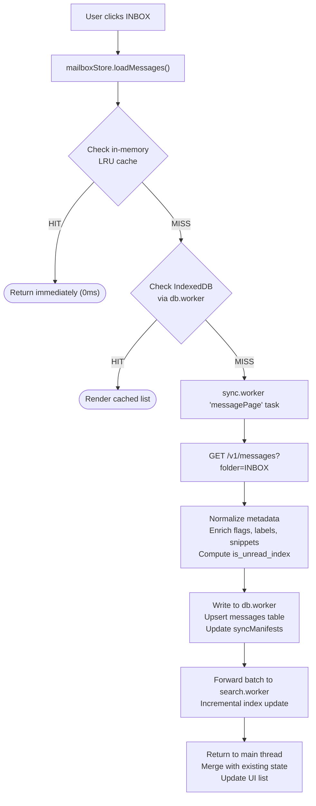

## Data Flow: Reading a Message

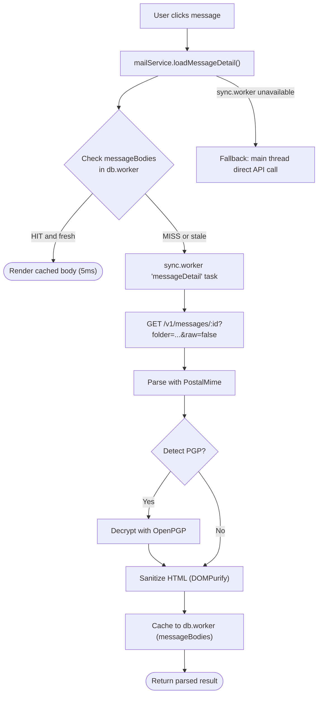

## Message Passing Protocol

All workers use a request/response protocol over `MessageChannel`:

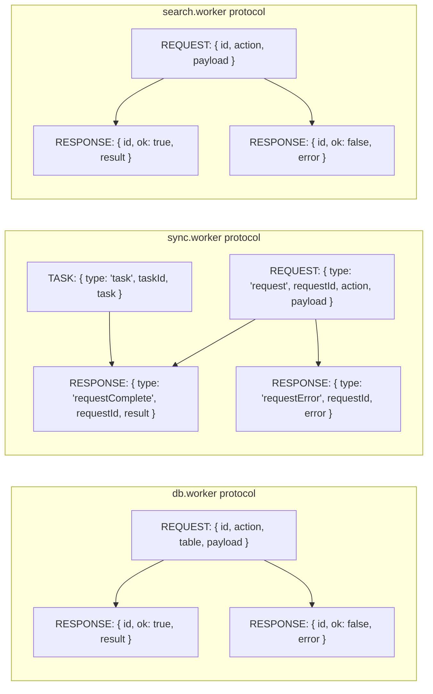

## Fallback & Resilience

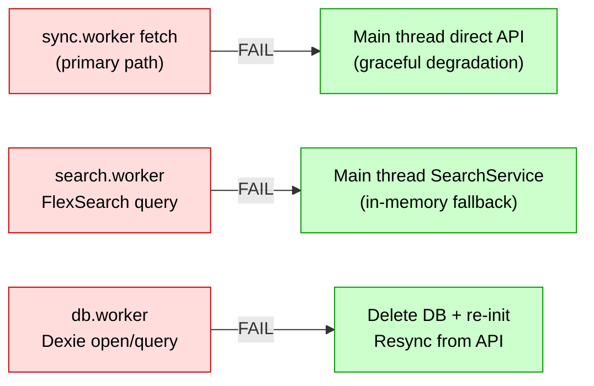

Workers can restart independently without UI resets. The main thread always has
a fallback path to direct API calls.

## Key Source Files

| File                                | Role                               |
| ----------------------------------- | ---------------------------------- |
| `src/workers/db.worker.ts`          | IndexedDB owner, schema, CRUD      |
| `src/workers/sync.worker.ts`        | API sync, parsing, PGP             |
| `src/workers/search.worker.ts`      | FlexSearch indexing and queries    |
| `src/utils/db-worker-client.js`     | Main thread proxy to db.worker     |
| `src/utils/sync-worker-client.js`   | Main thread proxy to sync.worker   |
| `src/utils/search-worker-client.js` | Main thread proxy to search.worker |
| `src/utils/sync-controller.js`      | Sync orchestration and scheduling  |
| `public/sw-sync.js`                 | Service worker background sync     |

---

**Next:** [Data Layer](building-webmail-db-schema-recovery.md) — how IndexedDB
becomes product memory.
