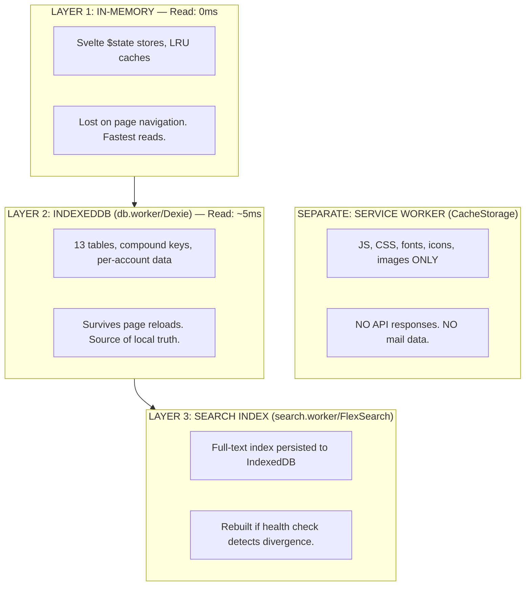
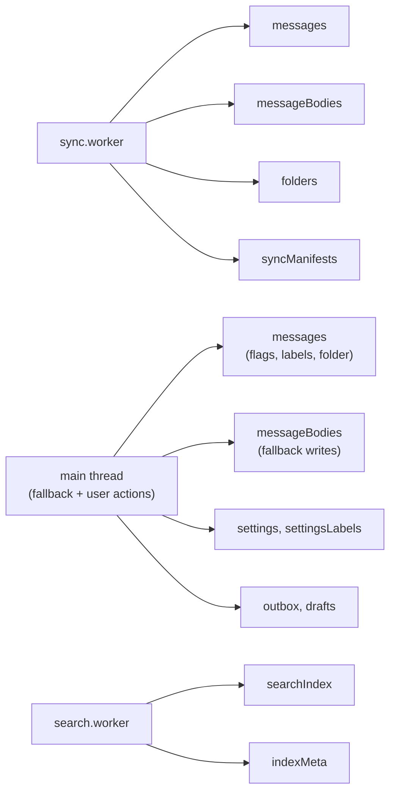
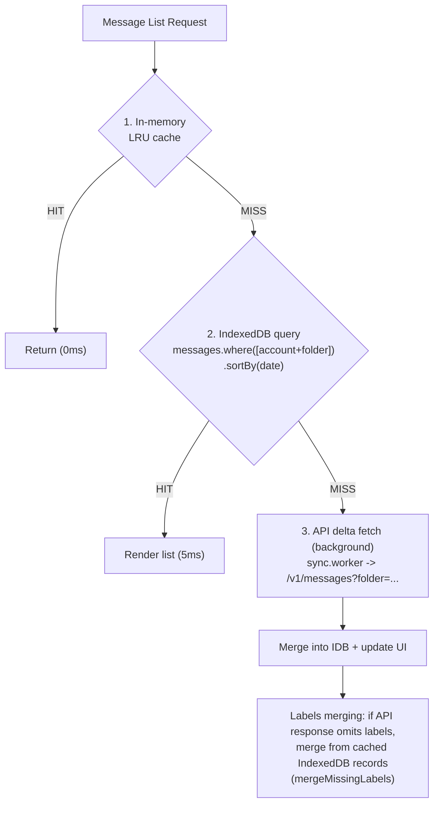
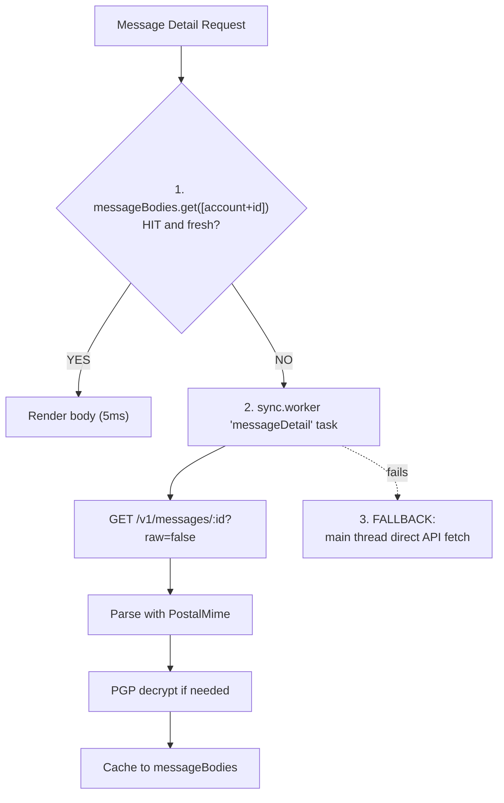
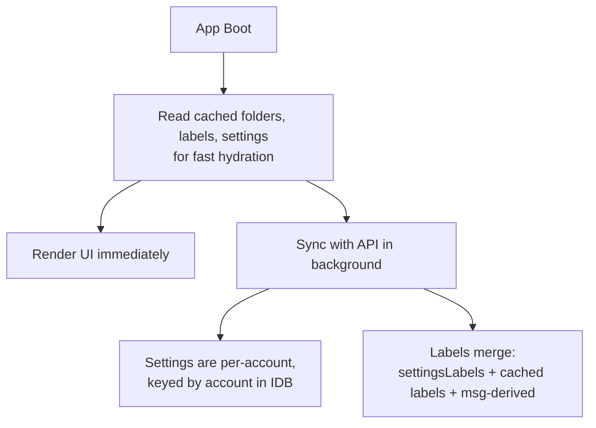
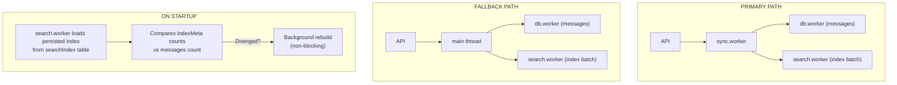
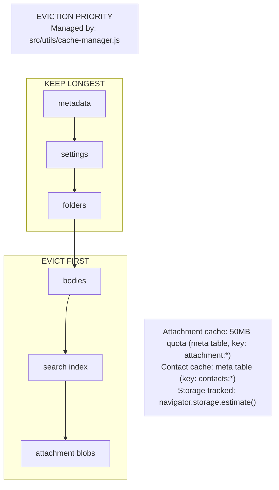
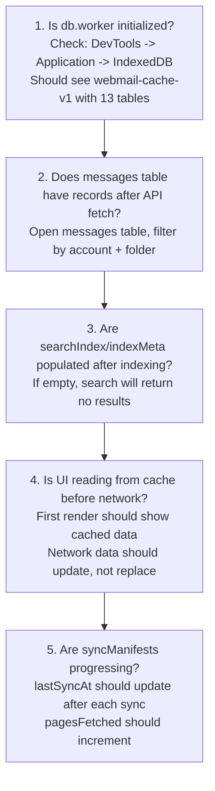

# Cache & Indexing Architecture: Detailed Reference

This is the deep-dive companion to [Building Webmail: Data Layer](building-webmail-db-schema-recovery.md).
It covers storage layers, write ownership, read patterns, eviction policies,
reconciliation strategies, and troubleshooting.

## Storage Layers at a Glance

## Who Writes What

## Read Patterns

### Message List

### Message Detail

### Folders / Labels / Settings

## Search Indexing Flow

## Data Freshness & Reconciliation

| DATA TYPE         | RECONCILIATION STRATEGY                                                   |
| ----------------- | ------------------------------------------------------------------------- |
| Labels            | Merge cached labels when API omits them (mergeMissingLabels)              |
| Flags (read/star) | Update in-place in messages table                                         |
| Moves / deletes   | Optimistic UI update, then update specific record in IDB on success       |
| Search index      | Health check on startup; rebuild if count diverges from messages table    |
| Sync progress     | syncManifests track per-folder cursor (lastUID, lastSyncAt, pagesFetched) |

## Caching Policies & Eviction

## Failure & Fallback Modes

| FAILURE                               | FALLBACK                                                              |
| ------------------------------------- | --------------------------------------------------------------------- |
| sync.worker fails                     | Main thread fetches /v1/messages and writes to db.worker              |
| search.worker fails                   | Main thread SearchService + DB query                                  |
| IndexedDB corrupt or version mismatch | Recovery: delete DB, re-init, resync from API. Credentials preserved. |
| Quota exceeded                        | Evict bodies and attachments first                                    |

## Troubleshooting Checklist

## Reference Files

| File                                | Role                             |
| ----------------------------------- | -------------------------------- |
| `src/workers/db.worker.ts`          | IndexedDB owner, schema, CRUD    |
| `src/workers/sync.worker.ts`        | API sync, writing to IDB         |
| `src/workers/search.worker.ts`      | FlexSearch indexing              |
| `src/utils/db-worker-client.js`     | Main thread proxy to db.worker   |
| `src/utils/sync-worker-client.js`   | Main thread proxy to sync.worker |
| `src/utils/search-worker-client.js` | Main thread proxy to search      |
| `src/utils/cache-manager.js`        | Eviction and lifecycle           |
| `src/utils/attachment-cache.js`     | Attachment blob cache (50MB)     |
| `src/utils/contact-cache.js`        | Contact autocomplete cache       |
| `src/stores/mailboxStore.ts`        | Message list orchestration       |
| `src/stores/mailService.ts`         | Message body + attachments       |
| `src/stores/settingsStore.ts`       | Settings + labels sync           |
