# Mailbox Loading Flow

This document traces the full request lifecycle when loading messages for a
mailbox folder — from user click through every cache layer, worker, and
network path, all the way back to the rendered list.

## High-level overview

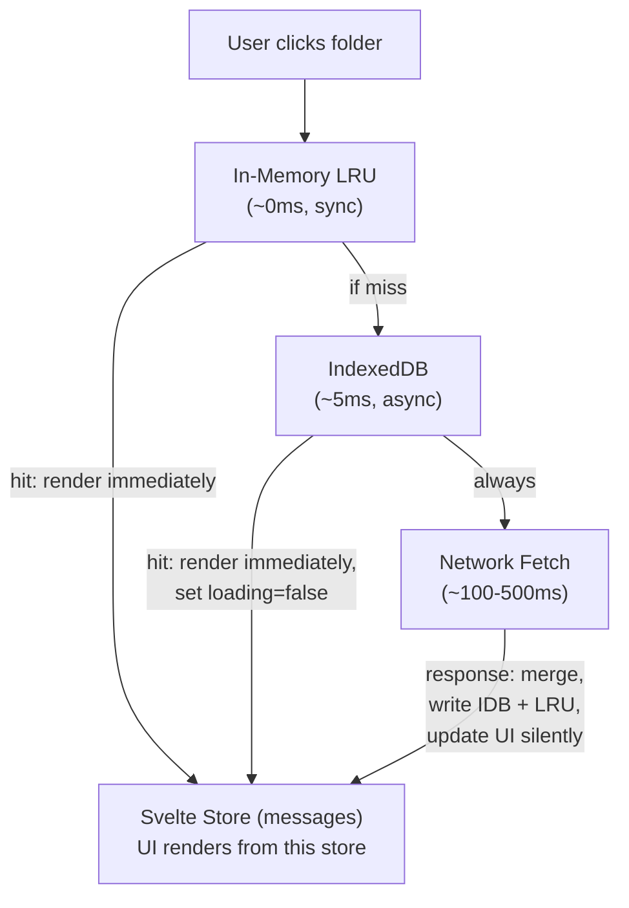

**Key principle**: cache is always read first. Network always runs in the
background. The skeleton loader only appears when both the in-memory and
IndexedDB caches are empty (e.g. first visit to a folder on a new device).

---

## Detailed request flow

### Phase 1 — Folder selection (synchronous)

**Entry point**: `mailboxStore.ts:selectFolder()`

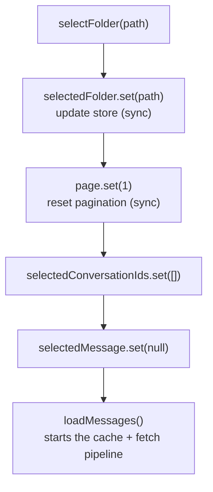

`selectFolder` and the first part of `loadMessages` run in the **same
microtask**, which means Svelte batches the folder change and any synchronous
cache hit into a single render frame.

---

### Phase 2 — In-memory cache check (synchronous, ~0ms)

**Location**: `mailboxStore.ts:loadMessages()` — in-memory LRU section

```
folderMessageCache : Map<string, { messages[], hasNextPage }>

Key format: "account:folder:page"
Example:   "user@example.com:INBOX:1"
```

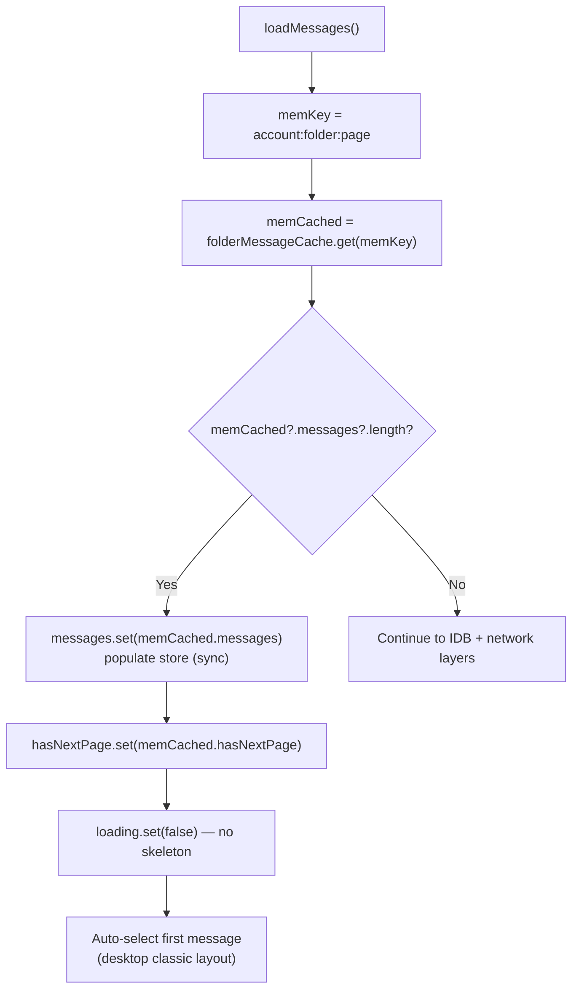

This runs synchronously. If the folder was visited earlier in this session,
the list renders instantly with no flicker.

**Regardless of a hit or miss, execution continues to the next layers.**

---

### Phase 3 — IndexedDB cache read (async, ~5ms)

**Location**: `mailboxStore.ts:loadMessages()` — IDB cache section

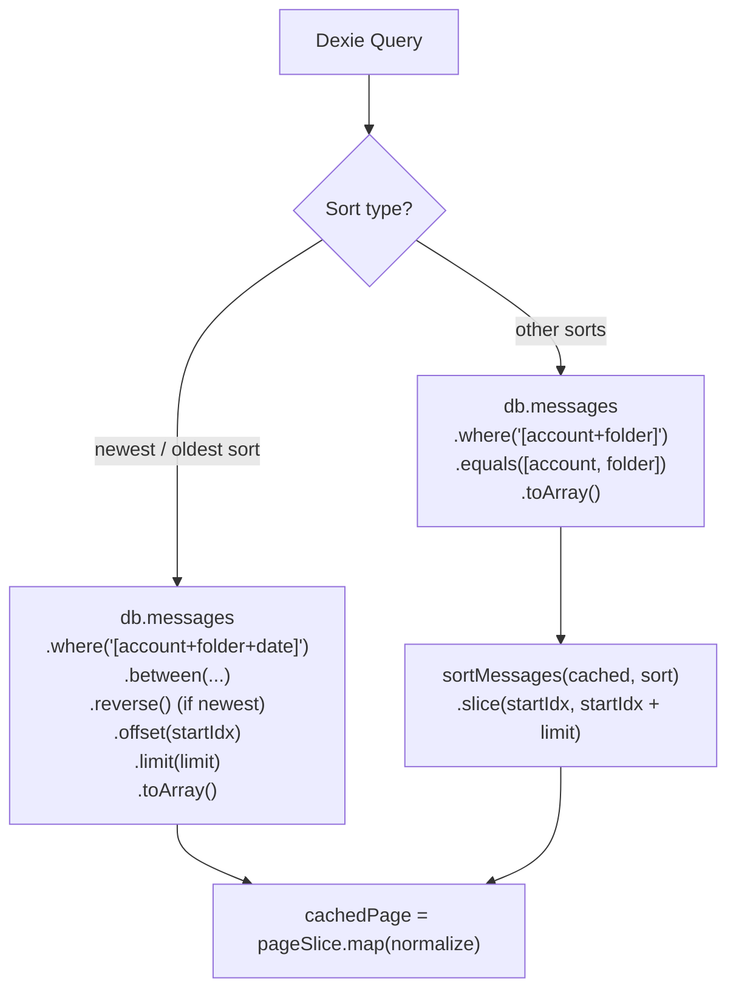

If `cachedPage` has results:

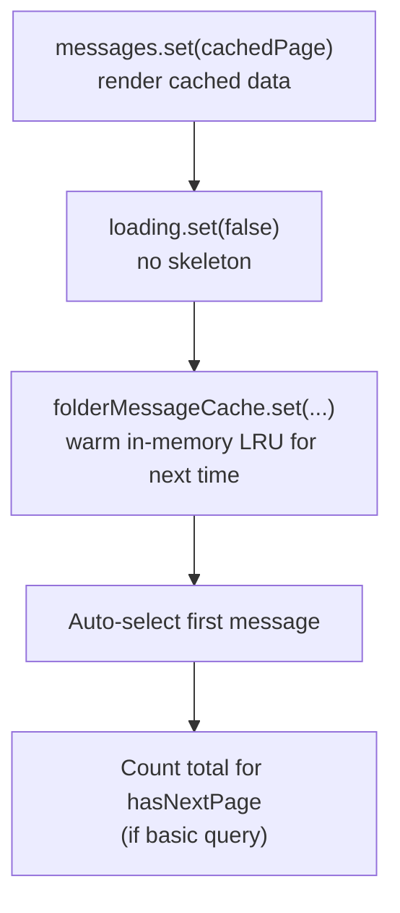

**The IDB read populates the list within ~5ms** — well under the 150ms
skeleton delay threshold. Users see cached data almost instantly.

---

### Phase 4 — Skeleton decision

**Location**: `mailboxStore.ts:loadMessages()` — skeleton gate

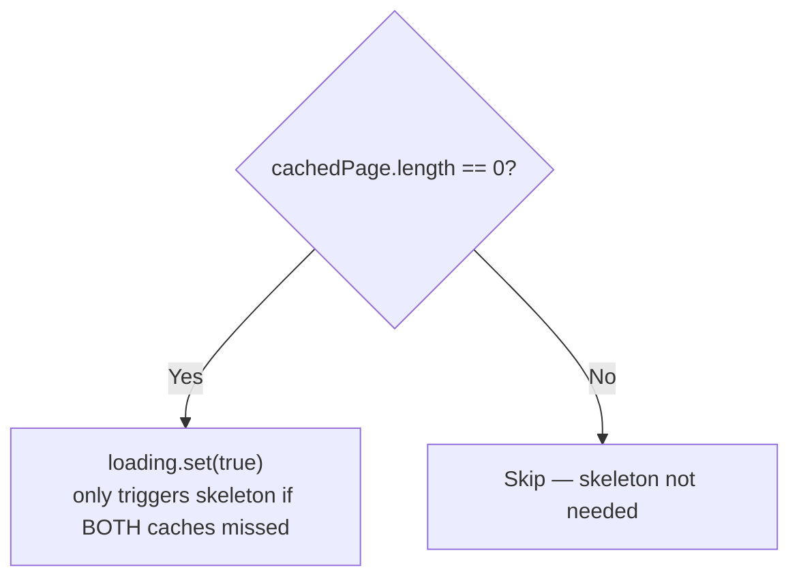

On the Svelte side (`Mailbox.svelte`), the skeleton has a **150ms delay**
before it actually renders:

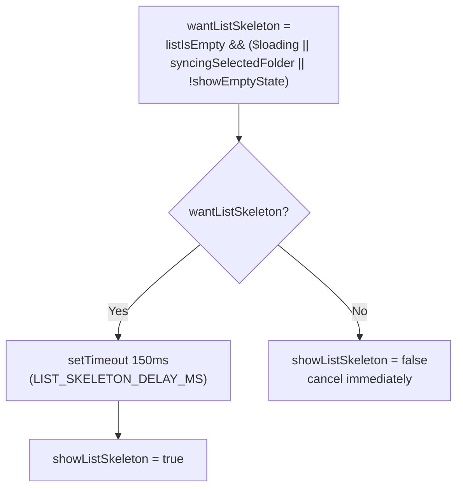

This means: if the IDB read or a preview fetch resolves within 150ms, the
skeleton never appears at all.

---

### Phase 5 — Preview fetch (empty-cache optimization)

**Location**: `mailboxStore.ts:loadMessages()` — preview section

When cache is completely empty AND the page limit is large (>20), a **parallel
small fetch** fires to get initial results on screen faster:

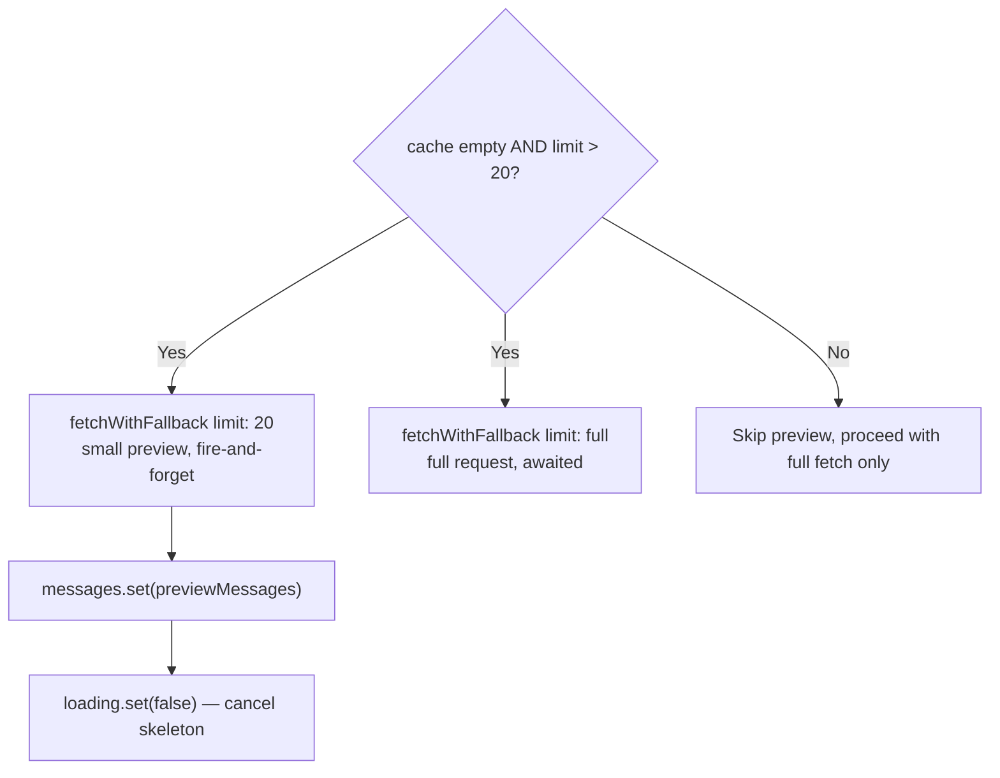

Both requests run concurrently. The preview typically resolves first and
clears the skeleton while the full page loads.

---

### Phase 6 — Network fetch via `fetchWithFallback()`

**Location**: `mailboxStore.ts:fetchWithFallback()`

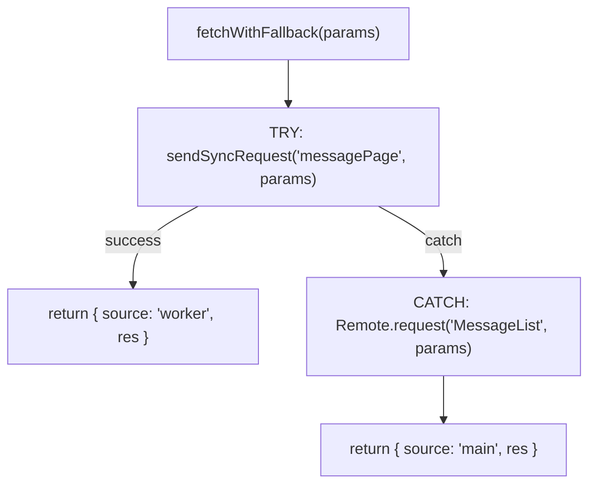

Two paths, worker preferred with main-thread fallback:

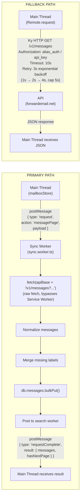

---

### Phase 7 — Response processing (main thread)

**Location**: `mailboxStore.ts:loadMessages()` — response handler

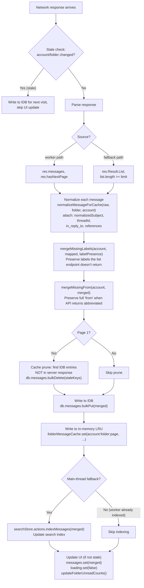

---

## Complete timeline visualization

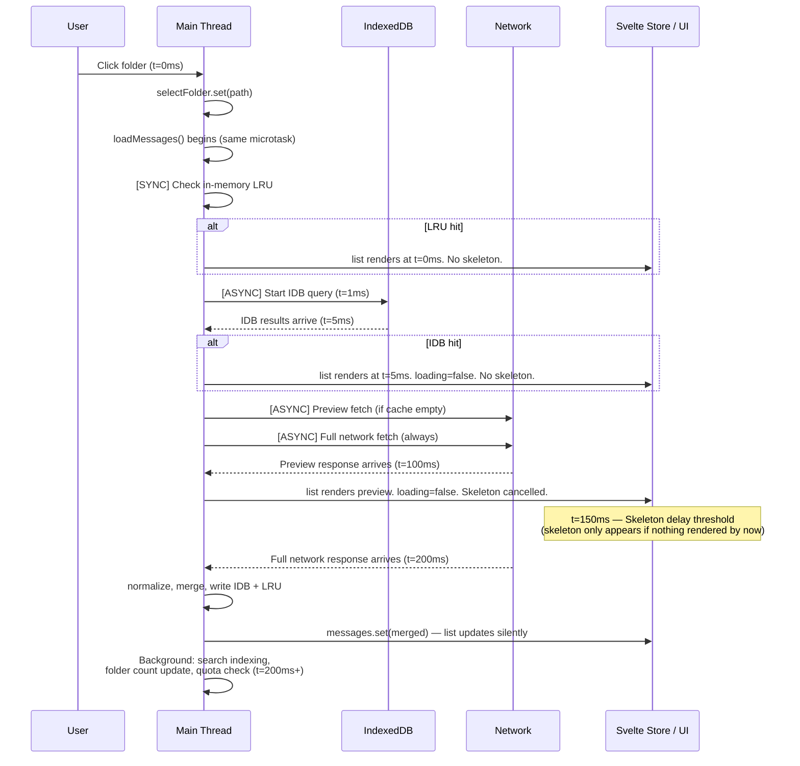

### When do you see a skeleton?

| Scenario                             | Memory     | IDB        | Network    | Skeleton?                       |
| ------------------------------------ | ---------- | ---------- | ---------- | ------------------------------- |
| Revisit folder (same session)        | hit        | --         | background | Never                           |
| Revisit folder (new session, cached) | miss       | hit (~5ms) | background | Never                           |
| First visit, fast network (<150ms)   | miss       | miss       | fast       | Never (preview beats delay)     |
| First visit, slow network (>150ms)   | miss       | miss       | slow       | Yes, until preview/full arrives |
| Offline, previously cached           | hit or hit | hit        | fails      | Never                           |
| Offline, never visited               | miss       | miss       | fails      | Yes, then error state           |

---

## Component responsibilities

### Sync Worker (`src/workers/sync.worker.ts`)

The sync worker is the **preferred network path**. It:

1. Makes raw `fetch()` calls to the API (bypasses Service Worker)
2. Normalizes raw API responses into cache-ready format
3. Writes results to IndexedDB via Dexie
4. Posts to the search worker for full-text indexing
5. Returns normalized messages to the main thread

**Why raw fetch?** The sync worker runs in a Web Worker context. Service
Workers intercept main-thread fetches but worker-originated fetches go
directly to the network. This is intentional — API responses are cached in
IndexedDB, not in CacheStorage.

### Service Worker (`public/sw-sync.js`)

The Service Worker does **not** cache API responses. Its roles:

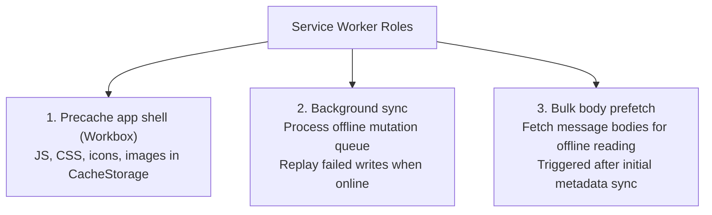

### Main Thread (`src/stores/mailboxStore.ts`)

Orchestrates everything:

- Reads from in-memory and IDB caches
- Delegates network to sync worker (with main-thread fallback)
- Manages loading/skeleton state
- Merges network responses into stores
- Prunes stale cache entries

### Remote (`src/utils/remote.js`)

Fallback HTTP client used when the sync worker is unavailable:

- Uses **Ky** (a `fetch` wrapper)
- 3 retries with exponential backoff
- Per-action timeouts (MessageList: 10s, default: 30s)
- Auth header from sessionStorage (tab-scoped)

---

## Data flow between components

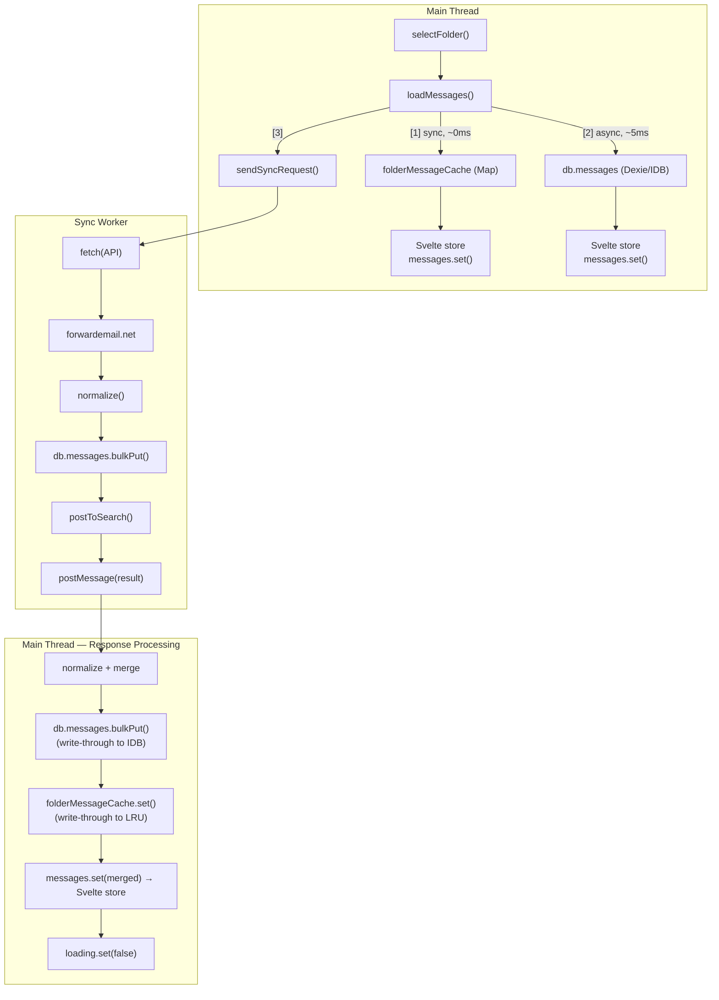

---

## Cache layers summary

| Layer                 | Type               | Speed        | Scope                             | Populated by                        | Cleared on                                                      |
| --------------------- | ------------------ | ------------ | --------------------------------- | ----------------------------------- | --------------------------------------------------------------- |
| `folderMessageCache`  | In-memory `Map`    | ~0ms (sync)  | Per page, per folder, per account | IDB read + network response         | Account switch (`resetMailboxState`)                            |
| `db.messages` (Dexie) | IndexedDB          | ~5ms (async) | All messages, all accounts        | Sync worker + main thread writes    | Cache prune (page 1 server diff), `emptyFolder`, quota eviction |
| Svelte stores         | In-memory reactive | ~0ms         | Current view only                 | Any cache layer or network response | Folder switch, account switch                                   |

### IndexedDB indexes used for message queries

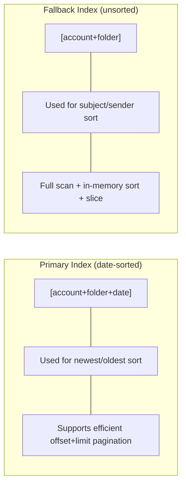

---

## Key constants

| Constant                 | Value              | Location                         | Purpose                                    |
| ------------------------ | ------------------ | -------------------------------- | ------------------------------------------ |
| `LIST_SKELETON_DELAY_MS` | 150ms              | `Mailbox.svelte`                 | Delay before showing list skeleton         |
| `SKELETON_DELAY_MS`      | 200ms              | `Mailbox.svelte`                 | Delay before showing message body skeleton |
| `EMPTY_STATE_DELAY_MS`   | 150ms              | `Mailbox.svelte`                 | Delay before showing "no messages"         |
| Preview limit            | 20                 | `mailboxStore.ts`                | Quick-fetch page size when cache is empty  |
| MessageList timeout      | 10s                | `remote.js`                      | Ky request timeout for message list        |
| HTTP retry count         | 3                  | `remote.js`                      | Exponential backoff retries                |
| DB name                  | `webmail-cache-v1` | `db-constants.ts` / `sw-sync.js` | Must match between app and SW              |

---

## Related documents

- [Worker Architecture](worker-architecture.md) — worker responsibilities and communication
- [Cache and Indexing Architecture](cache-indexing-architecture.md) — storage layers and search indexing
- [Service Worker](building-webmail-service-worker.md) — SW setup and background sync
