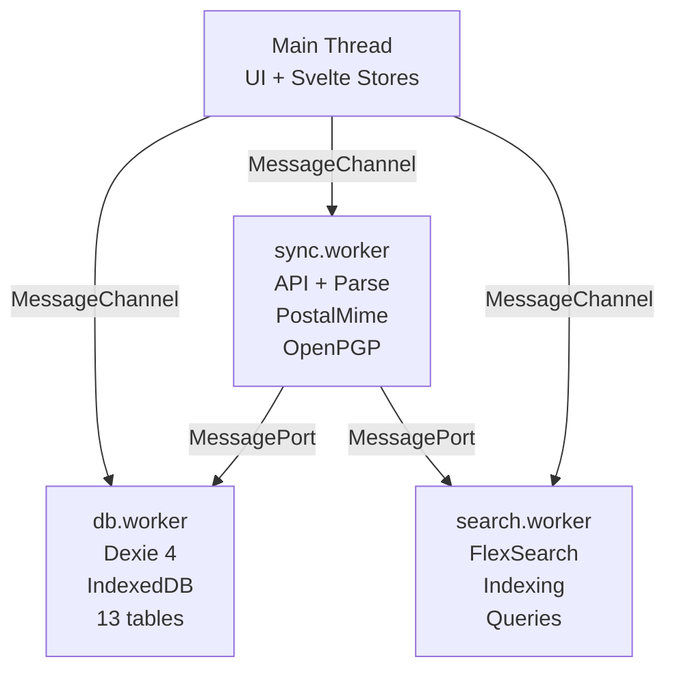
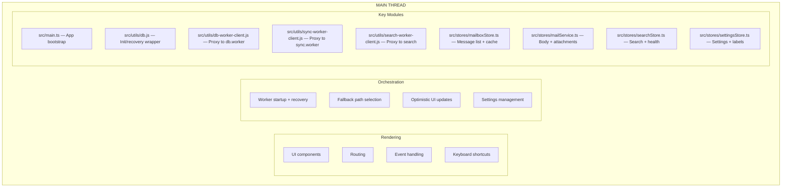
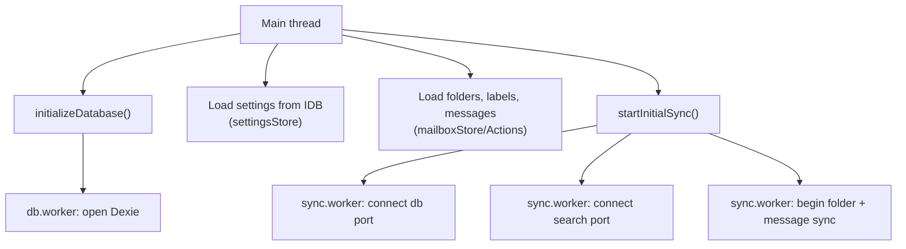
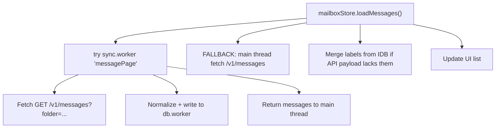
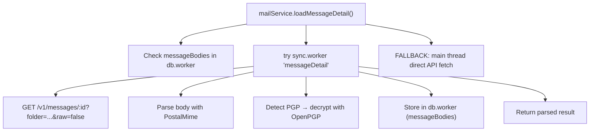
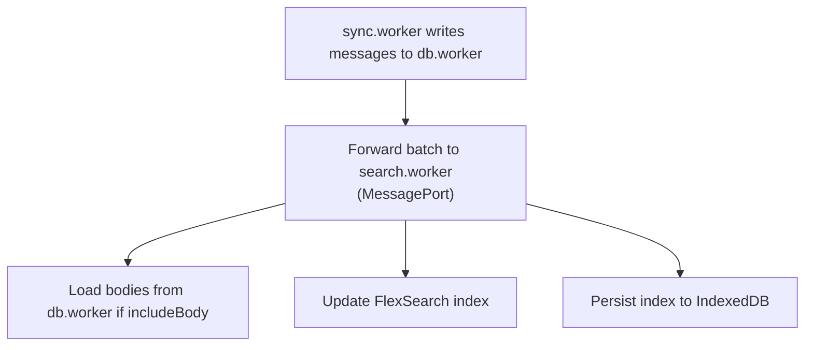
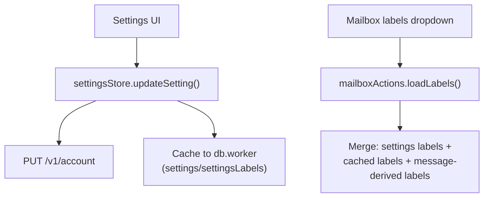
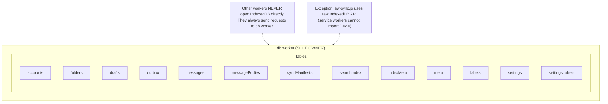

# Worker Architecture: Detailed Reference

This is the deep-dive companion to [Building Webmail: Workers](building-webmail-workers.md).
It covers message contracts, data flow diagrams, IndexedDB ownership, fallback
paths, and operational checklists.

## High-Level Overview



## Main Thread Responsibilities

The main thread focuses on rendering and orchestration:



## Data Flow Diagrams

### Startup (Happy Path)



### Message List (Mailbox View)



### Message Detail (Reader)



### Search Indexing



### Labels & Settings



## Message Passing Contracts

### db.worker

```
REQUEST:   { id: string, action: string, table: string, payload: any }
RESPONSE:  { id: string, ok: true, result: any }
        or { id: string, ok: false, error: string }
```

Common actions:

| Action  | Description                            |
| ------- | -------------------------------------- |
| get     | Read single record by key              |
| getAll  | Read all records (optionally filtered) |
| put     | Upsert single record                   |
| bulkPut | Upsert multiple records                |
| delete  | Remove by key                          |
| where   | Query with index + filters             |
| count   | Count records matching criteria        |
| clear   | Clear all records in a table           |

### sync.worker

```
TASK REQUEST:
  { type: 'task', taskId: string, task: { action: string, ...params } }

REQUEST/RESPONSE:
  { type: 'request', requestId: string, action: string, payload: any }
  { type: 'requestComplete', requestId: string, result: any }
  { type: 'requestError', requestId: string, error: string }
```

Common tasks:

| Task           | Description                          |
| -------------- | ------------------------------------ |
| messagePage    | Fetch page of messages for a folder  |
| messageDetail  | Fetch + parse single message body    |
| folderSync     | Sync folder list from API            |
| bodiesPass     | Background fetch bodies for a folder |
| decryptMessage | PGP decrypt a message body           |

### search.worker

```
REQUEST:   { id: string, action: string, payload: any }
RESPONSE:  { id: string, ok: true, result: any }
        or { id: string, ok: false, error: string }
```

Common actions:

| Action     | Description                  |
| ---------- | ---------------------------- |
| search     | Execute FlexSearch query     |
| index      | Add/update messages in index |
| remove     | Remove messages from index   |
| rebuild    | Full index rebuild from IDB  |
| stats      | Return index health info     |
| setAccount | Switch active account index  |

## IndexedDB Ownership



## Fallback & Resilience

| Component      | Fallback                              |
| -------------- | ------------------------------------- |
| sync.worker    | Main thread direct API calls          |
| search.worker  | Main thread SearchService (in-memory) |
| db.worker      | Delete DB, re-init, resync from API   |
| Message list   | Direct /v1/messages fetch             |
| Message detail | Direct /v1/messages/:id fetch         |

Workers restart independently. The main thread always has a degraded path
that keeps the app functional.

## Known Constraints

- db.worker MUST initialize before sync/search workers connect
- `SCHEMA_VERSION` in `db-constants.ts` must match `sw-sync.js`
- Labels are keyed by keyword/id; rename changes display name only
- Service worker does NOT cache API responses
- Workers use TypeScript (`.ts`) but are bundled by Vite

## Update Checklist

When modifying worker code:

- [ ] Update schema in src/workers/db.worker.ts
- [ ] Increment SCHEMA_VERSION in src/utils/db-constants.ts
- [ ] Ensure db.worker clients handle new tables/fields
- [ ] Update sw-sync.js if meta table structure changes
- [ ] Update this doc if responsibilities or flows change
